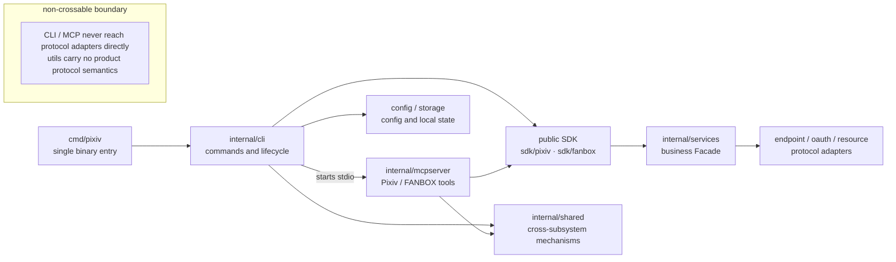

# Architecture

English | [简体中文](../../zh-CN/maintainers/architecture.md) | [Documentation index](../../index.md)

> [!IMPORTANT]
> CLI and MCP reach business capability only through the public SDK and owner-local narrow ports. Production assembly may depend on concrete implementations, but it must not expose locator, runtime graph, or protocol adapter to the command layer.

## Find a section by reader

| Reader / concern | Go to |
| --- | --- |
| Entry-to-SDK call chain | [Overall flow](#overall-flow) |
| What a package may or may not do | [Package responsibilities](#package-responsibilities) |
| Release trust root and signing | [Release assets and trust boundary](#release-assets-and-trust-boundary) |
| Local state, config, path permissions | [internal/config/paths](#internalconfigpaths), [internal/storage/file](#internalstoragefileatomiclockreplacesecret) |
| Hard constraint list | [Known constraints](#known-constraints) |

## Overall flow

`cmd/pixiv/main.go` is the only official binary entry; it only delegates to `internal/cli`:

1. `pixiv` with no arguments shows CLI help.
2. `pixiv auth/config/update/search/timeline/detail/ranking/recommended/user/bookmark/follow/download` enters CLI mode; root `--version` is a standalone read-only flag; `pixiv fanbox` enters FANBOX mode; `auth import` handles direct token import or bundle restore, and `auth export` handles the local secret snapshot.
3. `pixiv mcp` and `pixiv fanbox mcp` are assembled and run as independent MCP stdio servers by the CLI MCP commands.
4. CLI and MCP construct production resources explicitly per command owner:
   - Account credentials come from `~/.pixiv-cli/pixiv-cli.db` (SQLite, `internal/storage/database`; Windows: `%USERPROFILE%\.pixiv-cli\pixiv-cli.db`); the legacy `auth.json` is not read automatically — users must explicitly export/import a bundle
   - Global configuration comes from `~/.pixiv-cli/config.toml` (Windows: `%USERPROFILE%\.pixiv-cli\config.toml`)
   - Public environment variables participate as an override layer in the merge
5. There is no anonymous Web fallback: all content commands require an authenticated local account or explicit credentials; the removed `web_fallback_enabled`, if still present, returns `removed_setting`.

## Package responsibilities

### `cmd/pixiv`

The `main` package that produces the `pixiv` binary. It carries no business logic; it only delegates to `internal/cli.Run` and returns the process exit code.

### `internal/cli`

Owns command dispatch and output for the CLI user mode:

- Cobra command tree, help, and flag parsing.
- Text/JSON output.
- Input adapter for `auth import [REFRESH_TOKEN]`: positional argument is treated as an opaque token; with no argument on a TTY it reads hidden input, and on a non-TTY it distinguishes an opaque token from a strict bundle by the first non-whitespace byte; bundle restore happens via stdin pipe or redirection, with no `--file`.
- Secret-output adapter for `auth export`: without `--output`, the default/UID selection emits only the raw token and a newline, while `--all` emits only a versioned bundle; with `--output` it writes a private file and emits only a secret-free summary.
- CLI protocol `--page`/`--limit` parsing and error messages; the post-parse logical paging plan is delegated to the shared traversal algorithm in `internal/shared/pagination`.
- Loopback OAuth, browser launch, and TTY interaction for `auth login`.
- `pixiv mcp` dispatch.
- Input/output adaptation for root `--version` and `pixiv update`; the removed `version` subcommand returns unknown-command during Cobra parsing.
- Read-only automatic update notice after a successful normal CLI command; the notice and failure warnings are written only to stderr.

Currently `internal/cli/root.go` owns the command tree, global flags, exit codes, and production assembly; the close-resource list for a single execution is held by a private `closeState` there.
`internal/cli/invocation` only owns `Streams`. Command owners construct
config snapshot, DB, business Facade, lifecycle, media/download, and update dependencies through explicit factories and narrow ports, and close resources in reverse order.
CLI does not export a cross-command locator, nor does it have an independent bootstrap constructor or `internal/cli/runtime`.

The command tree is handled uniformly by `root.go` for global flags, requirement-driven startup lifecycle, and exit codes, then owner command packages register their domain commands:
root-level `internal/cli/commands/{config,mcp,update}`, Pixiv `internal/cli/commands/pixiv/{auth,bookmark,comment,detail,download,follow,mypixiv,ranking,recommended,search,series,timeline,user}`,
FANBOX `internal/cli/commands/fanbox/{auth,download,mcp,post}`. Data commands consume the public SDK `*pixiv.Client`/`*fanbox.Client` via the owner-local narrow
`Data` port (`Open`/`Pooled`/`JSONOut`, etc.) and never reach internal protocol adapter packages;
the shared stdin codec lives in `internal/cli/pipeline`, and the stable Pixiv record projection shared by CLI/MCP lives in `internal/shared/record`; that package only carries record protocol, JSON normalization, and public SDK DTO mapping, must not depend on CLI, MCP, or internal protocol adapter packages, and must not grow into a general dumping ground. These subpackages do not reverse-import the `internal/cli` root package.

root `--version` stdout is exactly one line, `pixiv <version>`, with empty stderr and no startup update check. The removed
`version` subcommand returns unknown-command during parsing with empty stdout. Automatic update runs only after a successful normal business command; it is skipped for MCP, help, root
`--version`, `update`, all `auth export`, bundle-form `auth import`, and dev builds. It selects the stable Release, uses a 24-hour
throttle on the user cache, and waits at most 3 seconds. Configuration, network, and source-identification failures only surface as stderr warnings; they must not
change the exit code of an already-successful business command, and must not leak into JSON stdout or MCP JSON-RPC.
Windows pending-update cleanup at process startup is also a potential mutation; all `auth export` invocations are identified before Cobra
parsing and skip that cleanup, while other commands still run the normal startup cleanup. The repeated-override semantics of root bool flags are
protected by focused tests, so that forms like `--help=false` cannot accidentally bypass the secret export boundary.

### `internal/cli/commands/pixiv/auth/loginhelper`

Owns the system URL scheme helper, persistent handler manifest, one-shot remote handoff private state, and remote callback client for `auth login`.
`internal/cli` only installs the on-demand handler through this package, retaining OAuth, loopback HTTP, system browser, TTY, and relay server orchestration. The
handler only allows exact `pixiv://account/login` and `pixiv://account/remote-login` to enter the current round; the active loopback takes priority, and remote callbacks are
delivered only to the active one-shot handoff, while other `pixiv://` URLs are routed to the handler persisted in the manifest. Desktop private state only stores the current
handoff's relay origin, session ID, and capability; the server stores no desktop device record, and the public SDK does not expose this state. The remote callback only accepts
a one-shot result URL on the same relay base; `internal/cli` opens the non-sensitive final page and then waits for OAuth exchange.
Darwin separately holds the embedded Swift, `Info.plist`, and LaunchServices; Windows uses the current-user registry/class launch; desktop Linux uses
an XDG desktop entry and `gio`. Headless Linux does not register a handler, but can run the relay server.

### `internal/shared/buildinfo`

Holds the `Version` injected by the Go linker. The local default is `dev`;
only builds whose version is `dev` are treated as dev builds and must reject self-update.

### `internal/shared/record`

Owns the stable Pixiv record projection shared by CLI/MCP: it preserves unknown fields of the public `sdk/pixiv` DTO,
fixes `id`, `type`, and `url`, and provides JSON normalization, version-metadata cleanup, and record-field-based local filtering.
This package does not depend on CLI, MCP, or `internal/services` protocol adapter packages; MCP's own output schema and DTO wrapping still live in
`internal/mcpserver/pixiv/internal/records`.

### Business Facade, accounts, and generic traversal

- `internal/services/pixiv` is the Pixiv business Facade, aggregating business leaf modules such as `account` and `pool`. `account` owns local accounts, login completion, default account, credential identity/rotation, and account management; `pool` owns selection, freezing, Gate, safe replay, and the related error semantics.
- `internal/services/fanbox` is the FANBOX business Facade, aggregating the FANBOX `account` leaf module and client lifecycle; the FANBOX session does not share type or lifecycle with the Pixiv refresh token.
- `internal/shared/lifecycle` only carries protocol-agnostic lifecycle, Lease, and Attempt; it does not own Pixiv/FANBOX account selection, credentials, or replay strategy.
- `internal/shared/traversal` only carries generic reentrant paged traversal (opaque cursor, logical skip/limit, single-batch compatibility semantics, and duplicate-cursor loop termination); bookmark and other product filter strategies still live in each CLI/MCP search adapter.

The config schema, `config.toml` path/get/set/unset, generated baseline, and the immutable `Snapshot` required for a single execution live in `internal/config/settings`; the protocol-agnostic month-truncation pure function lives in `internal/utils/date`. CLI/MCP use business Facades via owner-local narrow Seams and the MCP runtime `SDKPorts`, without directly depending on upstream Adapters. `internal/account` and `internal/session` have been deleted, with no compatibility alias retained.

### `internal/shared/diagnostics`

Provides an explicit, in-memory typed diagnostics scope. Pixiv MCP, FANBOX MCP, Pixiv/FANBOX
network transport, account pool, download, and FlareSolverr emit only the allowed module, operation, route, status,
proxy, UA, request ID, reason, and count fields through the scope; the default sink is Nop. The MCP request scope only
affects diagnostics, not JSON-RPC stdout. This package creates no log files, stores no response body,
Cookie, token, signed query, or arbitrary error dump; the public SDK stays silent when no explicit scope is present.

### Release trust root (`internal/update/installer`)

`internal/bootstrap` was deleted as part of the v1 migration and is no longer the CLI/MCP composition root. The production Ed25519 public trust root's
key ID and public key constants live in `internal/update/installer/release_installer.go`; `internal/cli/commands/update/production.go`
assembles the key ID→public key map and hands it to the Release installer, so callers cannot pollute the trust root. `internal/cli/root.go` only delegates to the update command
and does not construct the trust root. The public key fingerprint and known signing fixtures are verified by installer same-package tests; the private key is not in source or runtime config.
Read-only update checks do not need this key; this wiring itself cannot replace the independent release acceptance for each version.

### `internal/storage/database`

Owns the SQLite authority for local account state:

- Schema, migration ledger, and repository for `pixiv-cli.db`; account identity/credential is keyed by `user_id`,
  and Pixiv rotation and FANBOX session replacement use `credential_revision` compare-and-swap.
- SQLite uses forward-only migrations through schema v3. It upgrades legacy v1 databases with the v2/v3 changes and recognizes the final columns already present in this tree's initial schema without replaying duplicate DDL; the legacy `auth.json` and the legacy `account_pool.accounts` are not part of the startup migration path.
- Platform-appropriate private DB/journal file permissions (Unix-like `0700`/`0600`).
- auth export only reads the default, an exact UID, or all local accounts; it does not read environment tokens, refresh, go to the network, or mutate state.

The legacy `auth.json` is no longer a store or fixture API. Users must explicitly run
`pixiv auth export --all --output <private bundle>` on the old version, then run
`pixiv auth import < bundle.json` on the new version; on failure the reason is returned directly, and the old file is not auto-deleted.

### `internal/config/settings`

Owns `config.toml` and runtime configuration:

- `config.toml` schema, defaults, and configuration key definitions.
- Runtime configuration merge: `config.toml` and public environment variables.
- Strongly typed parsing and sparse write-back for `pixiv config path/get/set/unset`.

The configuration is split as follows:

- `pixiv-cli.db`: stores account identity and credentials (`pixiv_account`/`fanbox_account`), DB file permission `0600`; the legacy `auth.json` is not read automatically.
- `config.toml`: stores global configuration keys, including `[pixiv.auth].default_user_id` and `[fanbox.auth].default_user_id`; Unix-like file permission `0600`. The first-run compact baseline is generated from `SettingSpec` metadata and includes only entries marked `DefaultInFile`; advanced settings remain omitted until explicitly written. When no default account is set, the first account is selected by `sort_order`.

Runtime settings use `koanf` to merge `config.toml` with public environment variables; `config set/unset` uses `tomledit` for write-back, preserving comments, order, and layout as much as possible.

`internal/config/settings` defines the `FileStore` port, injected by the CLI private composition graph from the protocol-agnostic file mechanisms in `internal/storage/file/{atomic,lock,replace,secret}`: a temporary file with a random name (containing no credentials) is created in the same directory as the target, the full content is written, file `Sync` is performed, the file is closed, and only then is the target replaced. On Unix-like platforms the parent directory and file are proactively tightened to `0700` and `0600` respectively, and after atomic replacement the target directory is synced again;
if this call created one or more directory levels, then after the replacement is committed the target directory and each new directory's outer parent are synced in leaf→root order, so that both the file entry and the new directory entries fall within the durability boundary; existing directories still only sync the target directory.
If any directory sync fails, the remaining directories are still attempted and the errors are merged; the replacement is already committed, so the caller cannot assume the old file is still present. A failure in the pre-replacement write, file `Sync`, or close keeps the old target; a normal replacement failure and a recoverable partial-completion failure also keep or restore the old target and clean up the temporary
file. If recovery after a partial completion itself fails, the caller receives a combined error, the target path may be temporarily missing, but the same-directory recovery backup of the old content and the source temp of the new content are both retained for manual recovery; in this case "No temp residual" does not apply.
Other temporary-file cleanup failures are not swallowed but returned alongside the main error.

On Windows, file `Sync` and close are also performed before replacement: if the target exists, `ReplaceFileW` with a same-directory unique recovery backup is used; first creation uses `MoveFileEx` without overwriting the target. `ERROR_UNABLE_TO_MOVE_REPLACEMENT`
keeps target/source under their original names; `ERROR_UNABLE_TO_MOVE_REPLACEMENT_2` attempts to restore the old target that was moved to backup, and if restoration fails it keeps backup/source. A backup cleanup failure after a successful replacement is a committed error and is still treated as committed. A file created for the first time on Windows inherits the parent directory ACL, and replacing an existing target preserves that target's ACL; this protocol does not
proactively add or relax ACLs, but it also does not claim that `Mkdir`/`Chmod` will tighten DACLs, nor does it provide equivalent guarantees for POSIX mode or directory
fsync.

`update_check_enabled` corresponds to `[update] check_enabled`, default `true`; it only controls the automatic check after a successful normal CLI command, and does not disable a user-initiated `pixiv update`. `log_level` and `log_format` correspond to `[logging].level` and `[logging].format`; `info/text` are the defaults, while `debug/json` opt into the CLI-owned stderr presenter. Environment values override the file for the current invocation.

### `internal/browsercookies`

Owns the read-only browser cookie provider; it is not part of the public SDK, and does not depend on FANBOX, Pixiv, CLI, MCP, or the account store.
The root package (core) is protocol-neutral: it only accepts a fixed `CookieQuery`, discovers browser directories by security profile identifier,
and returns the target value as a redacted `Secret`; `chromium` supports explicit Chrome/Edge providers, `firefox` parses `profiles.ini`,
and `safari` only parses `Cookies.binarycookies` on macOS. Unknown Chromium derivatives are not fuzzily identified, and when multiple profiles are present without a selection, it fails explicitly. System/browser integration lives in `internal/browsercookies/system`: it imports and registers all
provider subpackages, so the root `New` can dispatch to every browser; the root package does not import any provider subpackage, and importing the root package alone does not register browsers.

The platform secret boundary is kept in the `secret` subpackage: macOS uses Keychain, Windows uses the current-user DPAPI, and Linux queries the Secret Service via `secret-tool` with fixed attributes. The Chromium provider reads Local State/Cookies from the platform profile root directory,
supporting v10/v11 GCM and legacy CBC; missing system tools, permission, lock, schema drift, and decryption format errors are all mapped to stable errors,
and no cookie, key, absolute path, or command output is written to logs, errors, JSON, or MCP. Cross-platform native provider evidence
must still be collected on the corresponding host per the v1.0.0 release-prep runbook; offline fixtures and cross-compilation only prove code/format contracts.

### `internal/update`

The root package only retains the coordinator and automatic-check API (thin root); install-source identification, GitHub Releases queries, SemVer selection,
cache, explicit update policy, and Release binary installation protocol are implemented by `internal/update/{source,release,installer,process}`,
and re-exported by the root package to the CLI composition root:

- Homebrew distinguishes stable/beta via the executable symlink and the keg `INSTALL_RECEIPT.json`; switching between the two
  formulas first uninstalls the conflicting formula, and on failure explicitly attempts to restore the original formula.
- `go install` requires matching both the Go build info and the actual `GOBIN`/`GOPATH/bin` executable; updates always use the
  exact tag of the selected Release.
- Other official binaries are treated as Release installs. Before installation, the platform archive is selected, the Ed25519-signed
  `checksums.json` is verified, the archive SHA-256 is verified, `pixiv --version` is run as an exact preflight after unpacking, and then an in-place
  atomic replacement in the same directory is performed.
- The GitHub Releases API is the only query backend; drafts are excluded, and stable checks do not include prereleases. ETag/cache
  are used for throttling and atomic persistence.
- The update selector enforces canonical SemVer on the published Releases of the current check channel; if any tag is invalid, it
  fails closed and reports that tag, rather than skipping it and selecting an older version. Stable selection excludes GitHub-marked
  prereleases before verification. Signatures, checksums, immutable tags, and the pre-install preflight together form the Release trust boundary.

This package must not disguise signature, checksum, HTTP, archive, replacement, or permission errors as "no update". The production trusted key,
signing private key and Keychain recovery copy, the protected `release` Environment, and the public remote have been configured per Task 20; the complete six-target
native evidence and staticlib manifest have been backfilled. v0.3.0 has completed the official tag, signed Release, and stable tap formula;
the failure semantics of Release installation remain a protective boundary, not a temporary degradation.

### `scripts/cmd`, `scripts/tests`, and `scripts/internal`

Each script entry still in use lives at `scripts/cmd/<name>/main.go`, which only handles argument parsing and calls the corresponding owner
package. Pure test carriers live in `scripts/tests/`: they only verify workflow, documentation, or installer behavior and carry no production implementation.
Implementation logic and same-package tests live in `scripts/internal/<name>`. Shared verifier/release contracts live in
`scripts/internal/workflow/yaml` (safe YAML AST operations shared by release and native-evidence verifiers),
`scripts/internal/releasecontract` (Release/native-evidence contracts and per-target Rust toolchain mapping), and
`scripts/internal/releasenotesrender` (GitHub Release body rendering, shared by `releaseassets` and history sync).

### `sdk`, `sdk/pixiv`, `sdk/fanbox`

The public SDK is the only external contract surface, exported only from these three packages:

- `sdk`: shared `Page[T]`, `Cursor` (Text/JSON codec), `Error` (sentinel, context chain, redaction), `ResourceRef`/`Resource`, and resource request/response/save types.
- `sdk/pixiv`: Pixiv App-only SDK. `Open/OpenWith/New/NewWith` constructors, OAuth `LoginSession`, credentials rotation, normalized models, opaque cursor, `ParseURL`, and resource reads. No anonymous Web path.
- `sdk/fanbox`: FANBOX SDK. `Client.ValidateSession`, creator/tag/post/home/supporting, two kinds of pagination, and resource reads; it does not read browsers, DB, or Pixiv credentials, and does not import `sdk/pixiv`.

The FANBOX native transport uses the Chrome 146 TLS profile and a built-in Firefox 148 HTTP User-Agent baseline, and only accepts an explicit HTTP client, proxy, UA, and optional
FlareSolverr options at construction. `FANBOXSESSID` is only allowed to propagate in validated requests to `api.fanbox.cc` and `downloads.fanbox.cc`;
third-party CDNs, Pixiv hosts, and solver control requests never carry this Cookie. The solver control transport
connects directly to FlareSolverr, the solver upstream proxy is only passed in as solver configuration and does not inherit the native or host environment proxy;
API/resource errors outside a challenge do not automatically enter the solver.

The legacy top-level `pixiv/` facade was deleted in v1; `pixiv` is retained as an import alias for `sdk/pixiv`. Auth backup (`AuthExportSelection`/bundle codec) still goes through the same local snapshot boundary of `sdk/pixiv`. The bundle contains an opaque refresh-token secret; it is an unencrypted point-in-time backup, not a live sync. After token rotation, old bundles or copies on other machines may be stale.

Callers define source mode, budget, filter, cursor persistence, and HTTP presentation in their own adapters. This repository does not provide an HTTP Provider, Discover, Probe, Capabilities, RSS, or crawler.

### `internal/services/pixiv/protocol`, `appapi`, `oauth`, `resource`

These existing paths remain upstream Adapters after the migration, composed only by the public SDK; they do not carry account/session business Facade:

- `protocol`: the single source of upstream base, profile header, endpoint catalog, and redacted adapter failure; it does not read config, send requests, or store response body, URL, header, or credentials.
- `appapi`: the credential-bearing App API transport/auth/retry adapter. It only exposes the narrow `GetJSON`/`GetRaw`/`PostForm` capabilities to endpoint families; idempotent JSON/raw response reads only retry once on the first 429 with a valid `Retry-After`, per context, and no longer carry novel/user/artwork business methods, route facades, or raw DTO/mappers.
- `oauth`: PKCE, code exchange, refresh, and token state.
- `resource`: policy-constrained resource transport, redirect/header/body boundaries.

v1 has deleted `internal/services/pixiv/webapi` and the anonymous Web/AJAX path: App API errors return a normalized error directly, without automatic protocol switching. Pixiv endpoint families live in `internal/services/pixiv/endpoint/{artwork,novel,user}/<leaf>`, where each family owns its own route, request, raw DTO, mapper, and continuation/error validation, and the parent package only owns normalized entities/values. FANBOX's `internal/services/fanbox/protocol` only owns product-specific session, cookie, challenge, URL policy, and narrow transport; `internal/services/fanbox/endpoint/{creator,post}/<leaf>` and `resource` each own their endpoint route/fixture/conversion. `sdk/fanbox` directly composes these Adapter capabilities, without depending on the business Facade.

### `internal/services/pixiv`, `internal/services/fanbox` (business Facade)

After the migration, the two product root packages aggregate account and session business respectively, without bringing CLI/MCP DTOs, filters, records, schemas, or output adaptation into services. The Facade only depends on the Ports of business leaf modules, the config snapshot, protocol-agnostic shared modules, and the public SDK; it must not depend on the concrete implementation of `internal/storage/database`, and the public SDK must not reverse-import it.

The business Facade of `internal/services/pixiv` unifies account opening, login completion, credential rotation, account-pool selection/freezing/safe replay, and Lease lifecycle; `internal/services/fanbox` unifies account selection, session validation, and independent client lifecycle, but does not introduce Pixiv account-pool strategy.

### Reverse-search Facade exception

Reverse image search is the only product capability that crosses the normal public-SDK boundary. The top-level contract and Facade live in `internal/services/reversesearch`; the provider protocol adapters live only in `internal/services/reversesearch/saucenao` and `internal/services/reversesearch/ascii2d`. Production assembly in `internal/cli/root.go` may depend on `internal/services/reversesearch/assembly` to bind the HTTP client, proxy, and SauceNAO key once per command/session. CLI owners under `internal/cli/commands` and all of `internal/mcpserver` may import only the top-level `internal/services/reversesearch` contract; they must not import the provider subpackages or the assembly package. The Facade returns domain results, while CLI/MCP adapters project canonical records at their output boundary.

The Facade loads a regular file or HTTP(S) source into one private snapshot, hashes it, and removes it after the provider work finishes. The deliberate source policy permits arbitrary readable regular files and private, loopback, or link-local URLs; the MCP server therefore belongs behind a trusted local-client boundary. Neither the source nor provider transport material crosses the output boundary: only source kind/hash, safe provider summaries/errors, domain evidence, and canonical `artwork`/`user` records are publishable.

### `internal/services/pixiv/endpoint/{artwork,novel,user}`

The three parent packages only own the normalized entities/values shared by their respective endpoint families; routes, wire DTOs, response validation, pagination, and mutation forms stay in the corresponding sub-families. novel and user no longer flow through a shared model package, preventing appapi or cross-domain mappers from becoming business owners again. Transport-layer constants such as MCP delivery still stay in `internal/mcpserver`.

### `internal/mcpserver`

Registers Pixiv and download capabilities as MCP tools. All Pixiv content, auth, resource, and write operations go through the public SDK; downloads are executed by the `DownloadManager` corresponding to the client execution snapshot. MCP's nullable `page`/`limit` are only parsed in this adapter; logical paged traversal is performed by the shared engine in `internal/shared/traversal`, and the legacy offset wire field has been removed. stdio transport and runtime lifecycle stay in each product's internal runtime, assembled and started by the CLI command.

Inside the package, it is split into `internal/mcpserver/pixiv` and `internal/mcpserver/fanbox`, each retaining only construction and registration aggregation; the shared runtime (App, SDK ports, paged read/write, record filter) lives in `internal/mcpserver/{pixiv,fanbox}/internal/{runtime,records,filters,outputs}`. Each tool is one package (e.g. `internal/mcpserver/pixiv/tools/search_illust`), owning its own input/output types, schema, and handler adapter, and only depending on shared narrow ports. MCP does not implement expressions, retries, archiving, or file templates itself: it compiles input before opening an SDK operation, then delegates download adaptation to `internal/media/downloader`; the public SDK does not carry batch download semantics. A runtime handler failure result retains its structured output and uses `isError=true`; a normal empty result is not disguised as a failure. For full wire semantics see [MCP tools](../mcp-tools.md#errors-pagination-and-output).

### `internal/media/downloader`

Owns download and local file persistence:

`internal/media/downloader` is the CLI/MCP download owner. It takes the public SDK client execution snapshot via the `DownloadTargetClient`/`DownloadClient` interfaces, and centrally owns source expansion, ID deduplication, page and quality validation, file acquisition and publication, progress events, and ugoira format selection; these semantics cannot be duplicated in adapters. `ResourceRef` is only resolved by the product Client; the downloader only consumes the verified opaque ref. The public SDK only retains atomic resource resolution/save capabilities and does not expose batch download workflows.

- `Download` synchronously downloads a list of IDs and returns the actual artifact path for each work.
- Single-page works are saved to the download directory.
- Multi-page works and ugoira create a per-work subdirectory.
- Single-page and multi-page works derive their extension from the upstream URL path and normalize cross-platform illegal characters the same way as the template-generated filename; Pixiv thumbnails use an explicit resource Content-Type to correct an ambiguous URL suffix when available, while unknown media types retain the URL extension.
- ugoira first downloads the SDK-verified `download_url` zip, then the Rust FFI encoder synthesizes GIF/APNG, or the public SDK publishes the ZIP/extracted frames as-is; an authenticated session may legitimately select App medium, but it must never be labeled as original.

The Rust crate is wired into cgo as a target-specific staticlib: darwin/linux/windows each have an amd64/arm64 selector; the Linux
selector also explicitly links the system `libm`, taking over the `sinf`/`expf` symbols of the Rust/image staticlib; the Windows selector passes
`-L${SRCDIR}/… -lugoira_rs` together with the Windows import libraries of the Rust std to pass `*-pc-windows-msvc` libraries,
so that cgo does not reject bare `.lib` paths with drive letters; native-evidence on Windows explicitly uses the runner-provided
`clang -fuse-ld=lld` for the link step, avoiding Go's GCC-only debug linker script being handed to the MSVC linker. Supported
release/source builds must select and link the real library from the six-target `manifest.json` of the same Rust source digest;
missing cgo, missing target library, or missing C linker must fail explicitly at compile/build time, and cannot fall back to `ffmpeg` or a runtime
stub. Source identity is folded into the first-party crate's Cargo/build/source inputs, the vendor closure, and the local
`quantette`; these paths disable Git text conversion in `.gitattributes`, so that Windows and Unix checkouts keep the same
Git blob bytes, rather than masking the difference in the digest algorithm. The digest algorithm first converts Windows backslashes from `filepath.Rel` to a
logical slash path, then filters `src/`, `.cargo/`, and `vendor/`; run `29189725013` proves that if the order is reversed, even
when all six runner jobs succeed, a Unix/Windows digest split occurs and is caught by consolidation fail-closed.
This run cannot be backfilled or concatenated with a later run. Rust `target/` is a machine artifact; the staticlib/manifest is a release input that
can only be committed after native verification.
The release archive's `LICENSE` and the generated license bundle are also pinned to LF checkout; run `29191200569` had six
source digests that matched, but the Windows archive's `LICENSE` bytes still diverged from the Unix/Git blob, so
consolidation failed closed again. This run also cannot be backfilled or concatenated across runs; a full re-run from the fixed SHA is required.
`internal/media/ugoira/staticlib` only carries the integrity contract of the source digest and manifest, and does not import the cgo encoder;
therefore the native-evidence **policy** gate can run before the target library is generated. `record` and `consolidate` also do not
trigger cgo linking, but respectively still require the already-generated staticlib/binary/archive and the full six evidence inputs; the download runtime
is still only linked to `internal/media/ugoira/rust` through the single FFI entry by `internal/media/ugoira`.

Run `29192425899` completed native build, real cgo GIF/APNG smoke, and binary/archive record on all six platforms,
and backfilled the six target libraries and the unified manifest via local fail-closed consolidation (this run was the first evidence
collection, and its responsibility has since been superseded by the pinned-toolchain rebuild of run `29567721284` as the sole source of the currently
committed six libraries; see the provenance note in `development.md`); source build validates
this manifest and the library hashes before linking. `ffmpeg` is only retained for explicitly enabled dev-quality comparison and is not in the production download path.

### `internal/media/ugoira`

Owns the ugoira `Format`, frame input, `Encoder`, the single cgo FFI entry, the Rust crate, and the staticlib/source-digest integrity contract. The downloader only depends on this package's `Encoder` interface and constructs the Rust encoder; it must not duplicate the FFI adapter or publication behavior. `internal/media/ugoira/staticlib` only validates the manifest, source digest, and committed target library files, and does not reverse-import the cgo encoder.

## Release assets and trust boundary

`scripts/cmd/releaseassets` packages the archives for a fixed set of six targets: darwin/linux use `.tar.gz`, Windows uses `.zip`;
each archive contains one `pixiv`/`pixiv.exe`, `LICENSE`, `THIRD_PARTY_LICENSES.md`, and the full
`third_party/licenses`; they are pinned to LF in Git, so that licensebundle can be verified byte-for-byte on Windows too.
When Windows Git Bash lacks `zip`, the packaging script explicitly uses the runner-preinstalled `7z`; other platforms use `zip`. Both branches
produce the same member set, and a missing archiver fails directly rather than producing an incomplete asset.
The finalize stage collects the SHA-256 of these six archives into `checksums.txt`, and generates an Ed25519 `checksums.json` with a key ID for the raw
checksum bytes.

`.github/workflows/release.yml` runs signing/publishing in the protected `release` Environment; it uses least privilege and
full-SHA Actions, and only publishes after verifying the asset set on a draft Release. The publish job hands the same verified
`release/checksums.txt` to the downstream renderer; stable/prerelease each generate a unique `pixiv-cli`/
`pixiv-cli-beta` formula. Four native macOS/Linux runners install the formula in their isolated local staging
 tap with a tap-qualified formula name and actually verify `pixiv --version`; this path does not use or write to
the public tap, and the trust required by Homebrew 6 is only written to the temporary trust store of the runner's local staging tap. Only the final protected
job can read the independent tap deploy key and push only the corresponding formula.
The official tag of v0.3.0 has gone through this release path and pushed the stable formula; subsequent tags must still independently satisfy the same installation gate. The complete
six-target native success evidence has backfilled the staticlib/manifest. The production signing private key, Environment, and public remote
have been configured per Task 20, and the public trust root for supported binaries has been configured in `internal/update/installer/release_installer.go`. The Rust crates.io dependency has been pinned by
in-crate source replacement to a complete vendor closure, and verified with an empty Cargo cache for offline metadata/build/test and the six
target license checks.

The Homebrew formula template is generated from the verified six-target `checksums.txt`, using only macOS/Linux assets; the stable
`pixiv-cli` and the beta `pixiv-cli-beta` conflict with each other and both install `pixiv`. The tap credential and the release key are different
trust domains: the tap private key is only allowed into the final push step of the final protected deploy job, and cannot replace the Release Ed25519 trust
root. The public tap's stable formula corresponds to v0.3.0; the beta formula is still only written by the pre-release channel. Because the anonymous URL of a draft
Release is not installable, the Release is made public first and then the four-architecture gate runs; on failure, the already-public Release is retained for handling,
but no corresponding formula is written.

The current Release archive does not plan to include Apple notarization or Windows Authenticode. When users encounter a Gatekeeper or
SmartScreen prompt, they must return to the verified project GitHub Release, checksum, and signing record, and must not treat the system prompt as
an error that the CLI can silently bypass.

### `internal/config/paths`

No generic constants package is retained. `config/paths` is the sole owner of app-managed paths, `AppDataDirName`, and
Unix-like private directory/file permission constants; it does not read business configuration and does not implement file writes. Pixiv protocol values, MCP delivery
values, and config keys/defaults still live in their owning domain packages. `internal/shared/diagnostics` owns the typed, protocol-neutral event contract, while `internal/cli/diagnostics` owns the optional text/JSON stderr presenter configured by `[logging]`. This is not a persistent operation log or the historical generic `slog` chain; MCP stdout remains reserved for JSON-RPC and errors still pass through the existing CLI, MCP, or public SDK interfaces.

### `internal/storage/file/{atomic,lock,replace,secret}`

The four leaf packages respectively own atomic write, file lock, replace/recovery, and the secret file writer; they only depend on the
path/permission conventions of `config/paths`, and do not own the config schema, account state, or Pixiv protocol semantics.

### `internal/utils`

Only retains protocol-semantics-free pure helpers: `parse` handles positive-integer parsing, `text` handles string defaults, `uri`
handles URL path extraction and file URI generation, and `date` handles month-based movement and end-of-month truncation in the target month.

Filename cleaning and template expansion live in `internal/media/downloader/filename`, ID deduplication and media MIME types live in `internal/media/downloader`;
refresh-token validation lives in `internal/services/pixiv/oauth`; paths/permissions live in
`internal/config/paths`, and atomic write, lock, replace, and the secret export writer live in
`internal/storage/file/{atomic,lock,replace,secret}`. Thus `internal/utils` no longer carries concrete infrastructure or product-domain responsibilities.

## Known constraints

> [!WARNING]
> The following constraints are non-negotiable hard boundaries. Any new timeout, truncation, count limit, retry cap, silent fallback, or hidden degradation must have evidence, a comment, a test, or documentation, otherwise it is treated as a violation.

- `appapi`, `oauth`, and resource transport use the HTTP client injected by the caller/SDK; the default client is dedicated to the current SDK client, has no fixed whole-request timeout, and cancellation/deadline is propagated via context. An explicit client retains the caller's policy.
- `pixiv mcp` and `pixiv fanbox mcp` are the explicit ways to start two independent MCP stdio servers; running `pixiv` directly does not start MCP.
- No persistent account import/export MCP tool is added; the existing session-scoped MCP auth tools and wire contracts are unchanged.
- Account credentials are stored in the SQLite `pixiv-cli.db` (BLOB, unencrypted); Unix-like DB/journal file permissions are `0600`. An attacker with file access for the current user can still read credentials, and automatic backups are prohibited.
- `config.toml` uses sparse writes and never persists the full set of defaults to disk.
- The default `count` for `download_random_from_recommendation` is 5; an explicit value must be 1..20, and out-of-range values return a parameter error rather than silent clamping. The 20 limit is on the number of requested works: a single request can trigger multiple work downloads, and each work can in turn expand into multiple pages/files; all artifact metadata enters the same structured response. This boundary prevents unbounded amplification of download work and JSON-RPC output, and does not truncate a single work's files. When the recommendation list has fewer items than requested, the actual available number is downloaded.
- `download` only returns local paths, `file://` URIs, `mime_type`, page numbers, and sizes; it does not embed ImageContent or base64 thumbnails.
