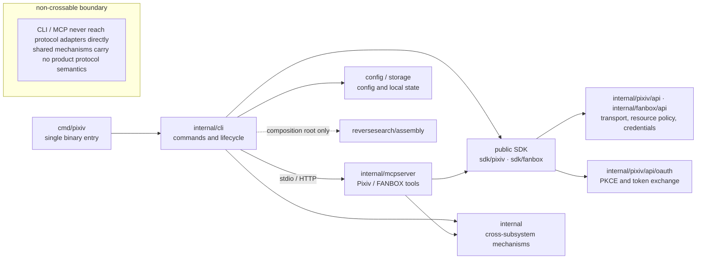
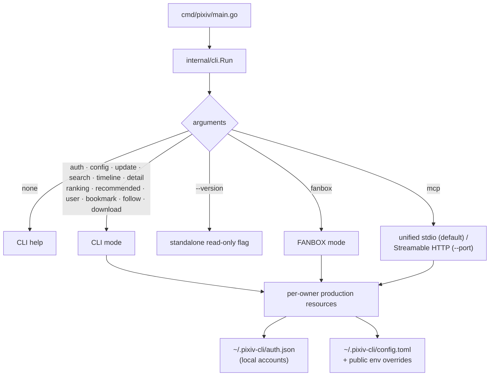
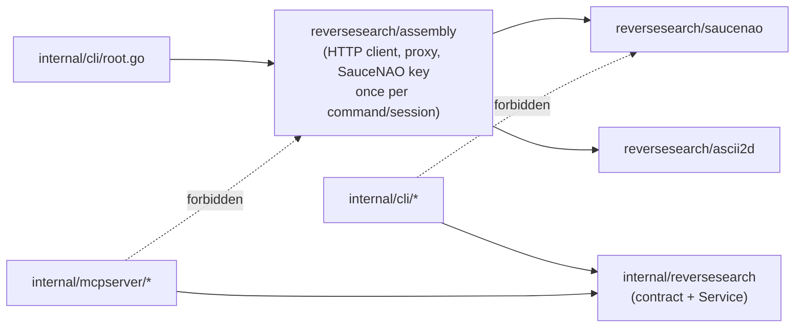
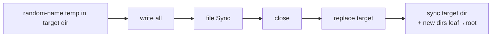
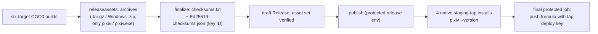

# Architecture

English | [简体中文](../../zh-CN/maintainers/architecture.md) | [Documentation index](../../index.md)

```mermaid
flowchart LR
    ENTRY["cmd/pixiv<br/>single binary entry"] --> CLI["internal/cli<br/>commands and lifecycle"]
    CLI -->|"stdio / HTTP"| MCP["internal/mcpserver<br/>Pixiv / FANBOX tools"]
    CLI --> SDK["public SDK<br/>sdk/pixiv · sdk/fanbox"]
    MCP --> SDK
    SDK --> API["internal/pixiv/api · internal/fanbox/api<br/>transport, resource policy, credentials"]
    SDK --> OAUTH["internal/pixiv/api/oauth<br/>PKCE and token exchange"]
    CLI --> SHARED["internal<br/>cross-subsystem mechanisms"]
    MCP --> SHARED
    CLI --> STATE["config / storage<br/>config and local state"]
    CLI -.->|"composition root only"| RSA["reversesearch/assembly"]

    subgraph boundary["non-crossable boundary"]
        RULE["CLI / MCP never reach protocol adapters directly<br/>shared mechanisms carry no product protocol semantics"]
    end
```

> [!IMPORTANT]
> CLI and MCP reach business capability only through the public SDK and owner-local narrow ports. Production assembly may depend on concrete implementations but must not expose a locator, runtime graph or protocol adapter to the command layer.

| Reader / concern | Go to |
| --- | --- |
| Entry-to-SDK call chain | [Overall flow](#overall-flow) |
| Page sources and embedding | [Frontend source and embedded pages](#frontend-source-and-embedded-pages) |
| What a package may or may not do | [Package responsibilities](#package-responsibilities) |
| MCP server, OAuth, media proxy, Gallery jobs | [MCP server architecture](architecture-mcp.md) |
| Release trust root and signing | [Release assets and trust boundary](#release-assets-and-trust-boundary) |
| Local state, config, path permissions | [internal/account](#internalaccount), [internal/config](#internalconfig), [internal/storage](#internalstorageatomicfilefilelocksecretfile) |
| Hard constraint list | [Known constraints](#known-constraints) |

## Overall flow

```mermaid
flowchart TD
    M["cmd/pixiv/main.go"] --> R["internal/cli.Run"]
    R --> H{"arguments"}
    H -->|none| HELP["CLI help"]
    H -->|"auth · config · update · search · timeline · detail<br/>ranking · recommended · user · bookmark · follow · download"| CMD["CLI mode"]
    H -->|"--version"| V["standalone read-only flag"]
    H -->|fanbox| FB["FANBOX mode"]
    H -->|mcp| MCP["unified stdio (default) /<br/>Streamable HTTP (--port)"]
    CMD & FB & MCP --> RES["per-owner production resources"]
    RES --> DB["~/.pixiv-cli/auth.json<br/>(local accounts)"]
    RES --> CFG["~/.pixiv-cli/config.toml<br/>+ public env overrides"]
```

- `auth import` handles direct token import or bundle restore; `auth export` the local secret snapshot. `pixiv fanbox mcp` is removed.
- Windows paths use `%USERPROFILE%\.pixiv-cli\`. On first account access, `auth.json` is created by importing the local `pixiv-cli.db` when present; the old database stays unchanged.
- No anonymous Web fallback: content needs an authenticated local account or explicit credentials. A leftover `web_fallback_enabled` is an undeclared key and is ignored.

## Frontend source and embedded pages

| Source dir | Owns | Embedding |
| --- | --- | --- |
| `frontend/mcp-apps/gallery/` | Gallery HTML/CSS/JS | CSS/JS inlined |
| `frontend/pages/login/` | login/callback/result templates and styles | kept separate, byte-preserved |
| `frontend/pages/oauth/` | consent HTML/CSS | CSS inlined |

The resource-only `frontend` package embeds exact paths (fixtures excluded) and assembles pages once at startup with the standard library; page behavior is checked manually in the relevant browser/MCP host. Go owners keep MCP registration, template rendering/data/escaping, CSP/media origin, canonical actions, CSRF and authorization. Current and historical resource URIs stay supported. No generation for clean builds or versioned `go install`; runtime reads only embedded bytes. Homebrew templates keep their owner.

## Package responsibilities

### `cmd/pixiv`

`main` package for the `pixiv` binary; no business logic, only `internal/cli.Run` and the exit code.

### `internal/cli`

CLI composition root. `internal/cli` is one `root.go` plus command directories; everything shared with MCP or another product lives at its module-level owner:

| File | Owns |
| --- | --- |
| `root.go` | `Run`, the Cobra command tree, global flags, requirement-driven startup hooks, exit-code mapping, stderr logger startup, broken-pipe policy, production wiring, and reverse-search ports; the only file importing `internal/reversesearch/assembly` |

Responsibilities: Cobra tree/help/flags; text/JSON output; `auth import` input adapter (positional = opaque token; no arg: TTY hidden input, non-TTY first non-whitespace byte picks token vs strict bundle; restore via pipe/redirect, no `--file`); `auth export` secret-output adapter (no `--output`: raw token + newline, or `--all` bundle; `--output`: private file + secret-free summary); `--page`/`--limit` parsing (logical plan in `internal/pagination`); loopback OAuth, browser, TTY for `auth login`; `pixiv mcp` dispatch; root `--version` and `pixiv update` (removed `version` subcommand → unknown-command during parsing); read-only automatic update notice on stderr.

- **Closing:** `lifecycle.CloseState` registers closers opened by `Run`; callers stop producers and finish registration before close; the mutex protects the list, not late registrations; closers must not register into or recursively close the same scope. Close follows command completion; MCP stdio waits for in-flight handlers; close errors are joined.
- **Owners:** `internal/cli` holds one `root.go` plus command directories; no `internal/` subdirectory and no test files. `root.go` wires production dependencies to command owners through explicit factories and narrow ports; registered resources close in reverse. No cross-command locator, bootstrap constructor or `internal/cli/runtime`. CLI contract tests live in `cmd/pixiv` and drive `cli.Run` as a black box.
- **Command packages:** root `internal/cli/{config,mcp,update,whoami}`; Pixiv `internal/cli/{auth,bookmark,comment,detail,download,follow,mypixiv,ranking,recommended,search,series,timeline,user}`; FANBOX `internal/cli/fanbox/{auth,browse,download}`. `internal/cli/fanbox` owns the group's persistent `--proxy`/`--no-proxy` flags. Pixiv query, comment and download commands use the new `*pixiv.Client` through `session.SDKExecutor`; list output uses `record.RunSDKList`. FANBOX commands use `*fanbox.Client` through a lazy session factory and `fanbox.UseClient`. `environment.Env` provides common input/output support.
- **Shared helpers live at their module-level owners:** `internal/environment` (input/output streams, stdin codec, flag binding, usage marking, lifecycle annotations), `internal/pagination` (`--limit`/`--page` parsing, `PagePlan`, pagination output fields), `internal/record` (record projection, NDJSON consumption and diagnostics, list JSON/NDJSON/text output), `internal/session` (Pixiv replay executor, FANBOX lease wrappers, and the production account/pool/session constructors), `internal/display` (terminal text rendering, identity format, upstream text escaping), and `internal/pixiv/target` (target resolution). These packages never import `internal/cli` or `internal/mcpserver`.
- **`--version` / auto-update:** stdout exactly `pixiv <version>`, empty stderr, no update check. Auto-update runs only after a successful normal command, skipped for MCP, help, `--version`, `update`, all `auth export`, bundle `auth import`, commands marked offline such as `whoami` and dev builds; stable Release, 24 h throttle on the user cache, ≤ 3 s; failures only as stderr warnings — never change the exit code or leak into JSON stdout or MCP JSON-RPC.
- **Windows startup cleanup** of pending updates is a potential mutation: all `auth export` invocations are detected before Cobra parsing and skip it. When changing root bool parsing, manually verify repeated overrides such as `--help=false` preserve the secret-export boundary.

### `internal/urlscheme`

Owns the `pixiv://` URL scheme: platform handler installation, callback dispatch, persistent handler manifest, one-shot remote hand-off private state and the remote callback client. `internal/cli/auth` installs the on-demand handler through it and keeps OAuth, loopback HTTP, browser, TTY and relay server orchestration. The relay HTTP protocol stays in `internal/loginrelay`.

| Platform | Mechanism |
| --- | --- |
| Darwin | embedded Swift, `Info.plist`, LaunchServices |
| Windows | current-user registry/class launch |
| Desktop Linux | XDG desktop entry + `gio` |
| Headless Linux | no handler; relay server still works |

Only exact `pixiv://account/login` and `pixiv://account/remote-login` enter the current round; the active loopback wins; remote callbacks go only to the active one-shot hand-off; other URLs go to the handler persisted in the manifest. Desktop state stores only the current hand-off's relay origin, session ID and capability; the server stores no device record; the SDK exposes none of it. The remote callback accepts only a one-shot result URL on the same relay base; `internal/cli` opens the non-sensitive final page and waits for exchange.

### Cross-cutting concerns

One owner per concern; no other layer implements it again.

1. A concern has one owning layer and one way of being passed in.
2. A business object may hold infrastructure, but only as one already-encapsulated dependency (a transport, a repository), never as its parts (`http.Client`, `selfHTTP`, `sync.Mutex`, cache maps).
3. Request-scoped information (cancellation, call correlation, logging) travels in `context.Context`, not in a field.
4. An injection point that exists only for tests stays out of the exported API. A same-package test may set an unexported field.

| Concern | Owner | Passed in as | Shape in a business object |
| --- | --- | --- | --- |
| Logging, diagnostics | `pixiv/api`, `fanbox/api` for requests and internal decisions; the execution boundary for the final result | new SDK: current slog default; legacy SDK: `Options.Logger`; internal call information: `context.Context` | no logger field |
| Cancellation, deadlines, call correlation | execution boundary | `context.Context` | method parameter |
| HTTP client, proxy, retry, Retry-After, request interval | `internal/pixiv/api`, `internal/fanbox/api` | once at construction | one transport field |
| Signed-URL cache, resource host allowlist | `pixiv/api` resource transport | same | no field |
| Resource release (`Close`, `CloseIdleConnections`) | creator; `lifecycle` provides `Lease` | returned close function or `Lease` | no extra field |
| Account snapshot, file lock, atomic update | `internal/account` | `Store` methods lock and reread `auth.json` | one store dependency |
| Local credential rotation persistence | `internal/account` | new SDK: account-bound `CredentialStore`; legacy SDK: `session.Pixiv.Open` / `Use` | new client construction is offline; refreshed credentials are saved before content requests |
| Configuration | composition root, read once | named field value at construction | value field, no `settings.Store` |
| stdout output (text, JSON, NDJSON) | CLI command layer | the command holds the writer | business code returns data |

Infrastructure packages themselves — `pixiv/api`, `fanbox/api`, `storage/*`, `media/downloader`, `mcpserver/pixiv/mediaproxy` — are not business objects. They own concurrency, caching, files, and network by design; the rule requires only a narrow interface and no leaked internals.

### Logging entry points

| Location | Owns |
| --- | --- |
| `internal/logging/` | text handler renders `[HH:MM:SS.mmm] [operation] [LEVEL] [parent/file:line]` with terminal-aware colors, quoted unprintable text and indented multiline values; JSON handler adds `source`; context call information and shared attribute keys live here; internal recovery points obtain the logger through `logging.From(ctx)`; SDK error origins remain private; typed transport attributes include `op`, `net`, `address` and known `errno` names without raw error text. |
| `internal/cli/root.go` | Creates the stderr logger and call context through `internal/logging`, installs it with `slog.SetDefault` at startup, and restores the previous default after command cleanup; logs `Command failed` at ERROR for JSON and DEBUG for text, with private legacy SDK `origin` when present; retains the stderr error path |
| `internal/cli/mcp/runtime.go`, `internal/session/options.go` | pass the same logger to legacy SDK `Options.Logger` and MCP ports; new Pixiv SDK options carry connection settings |
| `internal/mcpserver/toolrun/toolrun.go` | shared `Scope` / `AddTool` wrappers bind tool name and call ID; an error or `isError` result produces one controlled failure summary |
| `internal/pixiv/api/` (including `oauth/`), `internal/fanbox/api/` | holds the constructor-supplied logger and records outcomes at the actual request/decision point |

New SDK events use the current slog default handler, including protocol events through the existing adapter. Legacy SDK methods register `sdk_operation` through `logging.WithOperation` and keep a nil logger silent. New SDK errors omit the legacy private `origin`, and some events have no legacy `sdk_operation`. `operation` names the CLI command path or MCP tool, `call_id` distinguishes concurrent tool calls, and `source` identifies the logging location. CLI/MCP logs go to stderr, keeping data stdout and JSON-RPC clean.

### Shared mechanisms

| Package | Owns | Must not |
| --- | --- | --- |
| `internal/version` | linker-injected `Version` (default `dev`; only `dev` builds reject self-update) | — |
| `internal/record` | stable Pixiv record projection for CLI/MCP: new bound objects project into existing output values, with fixed `id`/`type`/`url`, JSON normalization, version-metadata cleanup and record-field local filtering; CLI NDJSON consumption with per-line diagnostics, list JSON spooling and the merged Pixiv/FANBOX list output | depend on CLI, MCP or adapters; become a dumping ground (MCP schemas and output envelopes stay in `internal/mcpserver/pixiv/internal/{records,outputs}`) |
| `internal/environment` | CLI-only execution environment: streams, stdin codec, flag binding, usage marking, lifecycle annotations | product protocol or account semantics; import `internal/mcpserver` |
| `internal/display` | CLI-only terminal text: entity list lines, detail cards, `username (UID)`, upstream escaping; merged `plaintext` | JSON/NDJSON output; renderers that serve one command |
| `internal/pixiv/searchfilter` | artwork-local rating/content-type normalization, client-side `x_restrict` and kind matching, cursor context hiding raw values | map rating to an unconfirmed upstream `x_restrict` param; hold clients, credentials or adapters (field availability and confirmed wire params stay with each command) |
| `internal/lifecycle` | protocol-agnostic lifecycle, `Lease`, `Attempt`, `CloseState` | own account selection, credentials or replay strategy |
| `internal/pagination` | logical pagination for one stream and ordered aggregates: filters before the global skip/limit budget, `OneBatch` stops at the first matching batch, truncation resumed via source-position checkpoint; `StreamState` = current stream + per-stream cursors (owners encode it with query/account/subtype bindings) | product semantics |
| `internal/pagination` | reentrant execute lifecycle for single/aggregate reads, clearing uncommitted results before safe replay | own command filter wiring |
| `internal/logging` | `log/slog` handler plus context call information; CLI, MCP, transports, pool, download and FlareSolverr share attribute keys and emit only operation, method, host, path, status, duration, attempt, wait, reason, count, origin, op, net, address and errno; text records put operation in the tag, JSON records keep it as a key and add `source`; SDK routing follows the logging entry points above | create log files or record bodies, Cookies, tokens, queries, signed URLs or arbitrary error cause dumps |

**Pooled reads:** legacy `session.Read[T]` reads within the `Runner`'s `Executor` callback and returns data only after the whole execution boundary succeeds; failure returns zero T. `Runner.Write` marks the attempt committed as soon as the mutation callback starts, even on error, preventing cross-account replay of an uncertain write. New CLI paths use `Local.ExecuteSDK`; MCP paths use `ReadSDK`, `WriteSDK`, `SDKReadExecutor` and the new collectors through `SDKPorts.ExecuteSDK`. `WriteSDK` commits on callback entry. Command owners keep streaming NDJSON, pagination, and partial delivery; JSON results stay buffered until success, while visible text/NDJSON output commits the attempt. `pagination` accepts both cursor types and clears uncommitted results before safe replay. Legacy MCP consumers retain `Execute`/`Read` ports.

**Output transition:** `record/pixiv_output.go` and `pixiv_user_output.go` project new SDK objects inside their attempt into legacy output DTOs. `pixiv_resource.go` preserves CLI resource identities; Gallery records use `RecordFromMediaArtwork` for readable image references. Usable URLs and headers stay on SDK objects or in the private media cache. `pixiv/target` parses URLs through the new SDK and projects references into the existing target descriptors. S16 removes these legacy output/resource/target types together with their remaining consumers.

### Business sessions, accounts and pool

- `internal/account` owns ordered Pixiv/FANBOX account snapshots, credential persistence, login completion, the rotation gate, read-session cache and Pixiv pool selection/freezing/safe replay. It receives its directory, network options and pool strategy from callers; default-account configuration stays in `internal/session`.
- `session.Local` assembles the shared store, `Accounts`, `FanboxAccounts`, `Pixiv`, `Fanbox` and read sessions. `Accounts`/`FanboxAccounts` combine local snapshots with `internal/config` defaults and provide the command-facing summaries, import/export and restore orchestration. Pixiv clients use either SDK generation; FANBOX clients retain `internal/legacy/sdk`; FANBOX credentials and lifecycle remain independent of Pixiv and have no pool strategy.
- `Store.OpenSDKClient` supplies new `sdk/pixiv` clients; `OpenAccountClient` retains legacy clients. The account-bound `CredentialStore.Load` reads the latest saved revision and pins the account creation time; `CompareAndSwap` compares both before saving, returning `false, nil` on a revision conflict. OAuth runs outside storage locks; the SDK reloads after a conflict and propagates save failures before content access. `Client.Credentials(ctx)` prepares credentials through the same flow without fetching content.
- `session.PixivOptions` supplies matching connection settings for both client generations. `Local.ExecuteSDK` shares the existing pool and gate and provides the selected UID separately: `Client.UserID()` may still be zero before credential loading. Resolve an omitted target inside each attempt; MCP fetch callbacks use `SDKUserID`. Stdio `ResolveSDKAccount` preserves the original request for pool scheduling; HTTP uses the persisted `ResolveAccount` snapshot. Bound SDK objects remain inside the operation.
- S11 migrates auth, whoami, artwork/user detail, user (including delegated user search), follow and bookmark CLI paths and the corresponding account/artwork/user/bookmark/related MCP handlers, including novel branches and aggregates inside those handlers. S12 migrates the independent novel, comment, text-search, ranking, recommendation, series, timeline and MyPixiv entry points. CLI downloads expand sources through `internal/pixiv/saving` and save pages with `sdk/download`; MCP downloads and media also use the new SDK; FANBOX and reverse search retain their separate transition paths. The full SDK reference rewrite remains with S16; current APIs are documented in the [SDK package GoDoc](../../../sdk/pixiv/pixiv.go).
- `Request.Selection` uses `SelectionFixed` with a positive UID or `SelectionPool`. Fixed reads/writes keep that identity; safe uncommitted reads may replay through the pool. The caller reads `enabled`/`strategy` from `internal/config`; `account` imports no config package and resolves no CLI default. With the pool disabled, session resolves the configured default or the first stored account.
- CLI/MCP use owner-local ports and MCP runtime `SDKPorts`; filtering, records, schemas and output rendering stay in their adapters. SDK packages keep local account storage outside their dependency graph.

**Login relay** — `internal/loginrelay` owns both the pure renderer, which consumes `frontend` templates/CSS without a CLI, store, browser or listener dependency, and the reusable HTTP handler/session: accepts the OAuth session validator and delivers one callback; never listens, exchanges or persists. CLI keeps listener/TLS/terminal. A host mux may mount it with its prefix stripped; production MCP mounts it at canonical base + `/pixiv-login/`, behind the same Host/Origin checks but authenticated by hand-off proof, not MCP bearer. Escaped prefixes are preserved in URLs and dispatch. A cancelled relay session returns HTTP 410 and rechecks cancellation before accepting a validated callback. The callback allowlist, start-response wire type and result URL header live in `loginrelay` and are reused by the CLI relay and desktop helper.

**MCP login relay** (`accounts.Login`) — single current login: repeated starts reuse pending work, restart cancels and joins, shutdown joins exchange/persistence. Completion keeps non-secret account-saved/selection-updated flags (incl. partial failure). The composition root binds it to the same SDK login session, saves credentials without touching the CLI default, then writes MCP selection. The account service is reused across restarts; each completed SDK login releases its idle HTTP connections (explicit proxy/direct: the root closes its client's idle connections on every exit).

### `internal/pixiv/api`, `internal/fanbox/api`

Upstream protocol implementations live under each product directory, `internal/pixiv/api` and `internal/fanbox/api`; CLI/MCP content operations reach them through the public SDK. The SDK owns endpoint requests, response validation, and mapping; protocol packages own transport and resource policy.

| Location | Owns |
| --- | --- |
| `internal/pixiv/api/api.go`, `transport.go` | App requests, auth headers, status handling, and pacing; idempotent reads retry once only on the first 429 with a valid `Retry-After`; mutations are not replayed |
| `internal/pixiv/api/routes.go`, `profile.go`, `failure.go`, `required.go` | route/parameter/header constants, request profile, redacted failures, and required-field decoding |
| `internal/pixiv/api/resource.go` | signed-URL cache, media host allowlist, resource reads, and redirect validation |
| `internal/pixiv/api/oauth/` | PKCE, authorization-code exchange, refresh-token rotation, and token state |
| `internal/fanbox/api/` | FANBOX session Cookie, native transport, identity cache, Cloudflare challenge/solver, media locator cache, and URL policy |
| `sdk/pixiv/` | account-bound references and objects; credential loading/refresh/persistence in `credentials.go` and `refresh.go`; endpoint requests, response validation and query-bound pagination in the corresponding domain files |
| `internal/legacy/sdk/` | clients and output DTOs for consumers awaiting migration; legacy cursor and resource contracts stay available through the transition |
| `sdk/fanbox/` | routes, requests, response validation, and mapping in `creator.go` and `post.go`; pagination in `pagination.go`; public resource operations in `resource.go` |

Legacy product clients hold one protocol client; new Pixiv requests construct their protocol client from the current credential snapshot. `RequiredList` / `RequiredObject` share field-presence decoding: `null` means Present true, Valid false; a missing field does not invoke the decoder. Callers handle decoding errors, check Valid, and reset reused outer response structs; domain code still checks response completeness.

### Reverse-search service exception

The only product capability crossing the normal SDK boundary.

Only `internal/cli/root.go` imports `internal/reversesearch/assembly`. CLI command owners and MCP owners may use the top-level `internal/reversesearch` contract; they must not import `assembly` or provider packages such as `saucenao` and `ascii2d`.

```mermaid
flowchart LR
    COMP["internal/cli/root.go"] --> ASM["reversesearch/assembly<br/>(HTTP client, proxy, SauceNAO key<br/>once per command/session)"]
    ASM --> SN["reversesearch/saucenao"]
    ASM --> A2["reversesearch/ascii2d"]
    CMDS["internal/cli/*"] --> TOP["internal/reversesearch<br/>(contract + Service)"]
    MCPS["internal/mcpserver/*"] --> TOP
    CMDS -.->|forbidden| SN
    MCPS -.->|forbidden| ASM
```

- The Service returns domain results; CLI/MCP adapters project canonical records at their output boundary.
- It loads a regular file or HTTP(S) source into one private snapshot, hashes it and removes it afterwards. Deliberate source policy permits any readable regular file and private, loopback or link-local URLs; under single-owner OAuth authorize only trusted connectors — paths are the MCP server's filesystem and URLs use the server network. Only source kind/hash, safe provider summaries/errors, domain evidence and canonical `artwork`/`user` records are publishable.
- Three network surfaces: standard source/SauceNAO client, dedicated ascii2d browser client, FlareSolverr JSON control client. The service proxy may override only ascii2d; a command-level override applies to both native clients; the standard client otherwise follows the global route. The ascii2d UA pairs with the `Chrome_146` TLS profile and matching Chromium hints (omitted for non-Chromium UAs). FlareSolverr's upstream proxy is used only by browser `sessions.create`; control traffic stays independent; the image always uses native ascii2d multipart. Solver state is process/client-scoped, not persisted.

### `internal/account`

- `Store` owns `auth.json` with `schema: "pixiv-cli.auth"` and `version: 1`. Ordered `pixiv`/`fanbox` arrays hold product-local UID identities, plaintext credentials and positive `revision` values. Array order is display order; new accounts append, updates keep their position. Pixiv `premium` is nullable, timestamps are UTC, and `pixiv_pool_last_user_id` records the single last pool choice (0 means no history).
- First access to a missing file, or valid JSON with a different/missing schema, runs migration 1. It imports `pixiv-cli.db` when present or writes an empty account file. Invalid JSON, a damaged own-schema document and a newer version return errors while preserving the file content. A valid current document is authoritative on later reads.
- Migration uses only `database/sql` and the existing `ncruces/go-sqlite3` driver in read-only mode. It checks `application_id=0x50495843`, schema versions 1–3 and a continuous migration ledger matching `user_version`. Import preserves account order, UIDs, names, revisions, premium and pool state. The old database's bytes and modification time stay unchanged; it is retained in place.
- Every read and update holds `auth.json.lock` and rereads the file. Updates validate the entire new snapshot and use `storage/secretfile` for atomic private replacement. Migration additionally holds `pixiv-cli.db.lock`, always after the JSON lock. Locks cover local snapshots and writes; OAuth and content requests run outside them. Cancellable lock waits use the existing `storage/filelock` cancellation behavior.
- Credential rotation performs OAuth outside the lock, then compares the stored revision and creation time and atomically saves the new token with an incremented revision. A conflict discards that client and reopens using the newer saved credential; a persistence failure returns an error before handing out a client.
- `ReadSessions` checks revision and creation time before cache reuse, before publishing a rotated client and before each content request. Detected replacement/removal invalidates that generation; metadata-only changes keep it. The creation time distinguishes a deleted and recreated UID. Account cache coherence uses these reads, with no filesystem watcher.
- Unix account directories/files use `0700`/`0600`; Windows atomic replacement follows the shared storage ACL policy. Credential values remain redacted in ordinary JSON, fmt and slog; only file encoding and explicit credential flows expand them. Auth export reads stored credentials locally, without token refresh or config changes.

### `internal/config`

| Store | Holds |
| --- | --- |
| `auth.json` | Ordered Pixiv/FANBOX account identity, credentials, revisions and pool state; Unix `0600` |
| `config.toml` | Global keys including `pixiv.auth.default_user_id` and `fanbox.auth.default_user_id`; Unix `0600`. Without a default, session selects the first account in array order |

#### Native TOML configuration

`Config` uses nested structs with native `toml` tags. `Store.Current` starts with `Default()`, decodes the file with `go-toml/v2`, applies explicit environment overrides and validates the result. Missing fields retain defaults; unknown file keys are ignored. Each read returns its own configuration values. File values follow the declared TOML types; the decoder reports type errors before environment overrides are applied.

- `environment.go` assigns the supported variables explicitly. Presence selects a value, including an empty string; lowercase `https_proxy` precedes `HTTPS_PROXY`. The public list is in [Environment variables](../cli-reference.md#environment-variables).
- Service proxy and User-Agent pointers distinguish absence from an explicit empty value. An absent service proxy inherits the global route; an empty one selects direct access. A FlareSolverr group requires a non-empty URL when either field is configured.
- `values.go` maps TOML leaf paths to `Config` field pointers and owns field validation. `Keys()` supplies the CLI help list. `config get/set/unset` accepts these paths, including service and default-account settings. `get` prints the effective value directly, including API keys; `set` accepts a value argument or stdin and validates the target field.
- `document.go` uses `tomledit` to edit the target value, preserving its comments and other keys, including obsolete keys. It handles ordinary sections, dotted keys and inline tables, then checks TOML semantics and the edited solver group before writing. Unrelated invalid settings can still be repaired individually. `unset` retains section comments even when a section becomes empty.
- `default.toml` is embedded with `go:embed` and written unchanged on first creation. Its English comments include optional service/solver/account examples. The template-decoding test compares it with `Default()`.
- Default-account read/write methods remain here. Standalone readers validate the selected UID without validating unrelated settings; `Config` represents the optional UID fields as `*int64`. `AccountPool` contains only `Enabled` and `Strategy`; schedulable membership, freeze state and the scheduling marker stay with `internal/account`.
- `paths.go` owns app-managed paths, `AppDataDirName` and Unix private permission constants. `HTTPClient` creates an independent transport for the selected proxy, with an empty value selecting direct access. Config parsing has no storage-package dependency: the composition root injects `secretfile.ConfigFiles` through `FileStore`, reusing the existing private-file write protocol.

To add a setting, update its `Config` field and native tag, `Default()`, the CLI field mapping and relevant validation, the embedded template and both public locale references. Add explicit environment assignments only for supported variables. Use the existing precedence/empty-value test where applicable under the [test submission rules](coding-standards.md#test-submission-rules).

| File | Responsibility |
| --- | --- |
| `config.go` | Configuration types, native tags and defaults |
| `store.go` | File port, embedded template creation and effective config loading |
| `environment.go` | Explicit environment assignments and override detection |
| `values.go` | CLI field paths, formatting, normalization and value rules |
| `document.go` | TOML targeting and sparse mutation |
| `auth.go` | Default-account read/write |
| `paths.go` | App-managed paths and private permission constants |
| `http.go` | HTTP transport construction for a configured proxy |

**Atomic writes** (`FileStore`, implemented by `internal/storage/secretfile.ConfigFiles`):

```mermaid
flowchart LR
    T["random-name temp in target dir"] --> W["write all"] --> S["file Sync"] --> C["close"] --> R["replace target"] --> D["sync target dir<br/>+ new dirs leaf→root"]
```

- Unix tightens parent/file to `0700`/`0600`. If this call created directories, after commit the target directory and each new directory's parent are synced leaf→root so both file and directory entries are durable; existing directories sync only the target dir.
- Failures: before replacement (write/Sync/close) the old target stays; normal replacement and recoverable partial failures keep/restore the old target and clean the temp. A failed directory sync still tries the rest and merges errors — the replacement is committed, so the old file may be gone. If recovery after partial completion fails, the caller gets a combined error, the target may be temporarily missing, and both the same-dir recovery backup and the new-content temp are kept for manual recovery ("no temp residual" does not apply). Other temp-cleanup failures are returned with the main error.
- Windows: Sync and close before replacement; existing target → `ReplaceFileW` with a same-dir unique backup; first creation → `MoveFileEx` without overwrite. `ERROR_UNABLE_TO_MOVE_REPLACEMENT` keeps target/source names; `ERROR_UNABLE_TO_MOVE_REPLACEMENT_2` tries to restore the moved-to-backup target, else keeps backup/source. Backup cleanup failure after success is a committed error. New files inherit the parent ACL, replacements keep the target ACL; no ACL tightening or POSIX-mode/directory-fsync equivalence is claimed.

`update.check_enabled` (default `true`), only for the automatic check, never user-run `pixiv update`. `logging.level` / `logging.format`; `info`/`text` default, `debug` adds request and decision records and `json` selects JSON records; env values override per invocation.

### `internal/browsercookies`

Read-only browser cookie provider; not public SDK; no FANBOX, Pixiv, CLI, MCP or account-store dependency.

| Part | Role |
| --- | --- |
| root (core) | protocol-neutral; fixed `CookieQuery`; discovers browser dirs by security profile ID; returns a redacted `Secret`; `sqlite.go` runs read-only queries through the system `sqlite3`; imports no provider (importing root alone registers nothing) |
| `chromium` | explicit Chrome/Edge providers; Local State/Cookies from the platform profile root; v10/v11 GCM + legacy CBC; `secret_*.go` implements macOS Keychain, Windows current-user DPAPI, and Linux Secret Service via `secret-tool` with fixed attributes |
| `firefox` | parses `profiles.ini` |
| `safari` | `Cookies.binarycookies`, macOS only |

Callers that need every browser blank-import `chromium`, `firefox`, and `safari` to register them, then call root `New`.

Unknown Chromium derivatives are not fuzzily matched; multiple profiles without a selection fail explicitly. Missing tools, permissions, locks, schema drift and decryption errors map to stable errors; no cookie, key, absolute path or command output reaches logs, errors, JSON or MCP. Native evidence per platform must be collected on the host per the release-prep runbook; offline fixtures and cross-compilation prove only code/format contracts.

### `internal/selfupdate`

Thin root (coordinator + auto-check API + a shell-free command runner), re-exporting the `internal/selfupdate/{source,release,installer}` types to the CLI composition root.

| Install source | Update behavior |
| --- | --- |
| Homebrew | stable/beta from the executable symlink and keg `INSTALL_RECEIPT.json`; switching uninstalls the conflicting formula first and explicitly tries to restore the original on failure |
| `go install` | must match Go build info **and** the actual `GOBIN`/`GOPATH/bin` executable; installs the exact selected tag |
| Release binary | select platform archive → verify Ed25519 `checksums.json` → verify SHA-256 → exact `pixiv --version` preflight → same-dir atomic replace |

- GitHub Releases API is the only query backend; drafts excluded; stable excludes prereleases before verification; ETag/cache for throttling with atomic persistence. Canonical SemVer is enforced on the channel's published Releases — one invalid tag fails closed and is reported (never skipped for an older version).
- Signature, checksum, HTTP, archive, replacement and permission errors are never disguised as "no update". Release-install failure semantics are a protective boundary, not a temporary degradation.
- **Trust root** (`internal/selfupdate/installer`): key ID and public key constants live in `release_installer.go`; `internal/cli/update/production.go` builds the key ID → key map for the installer so callers can't pollute it; `composition.go` calls the production update constructors directly. The offline installer test verifies that a signed download with a bad archive checksum preserves the existing binary; the private key is not in source or config; read-only checks don't need it; this wiring does not replace per-version release acceptance. `internal/bootstrap` was deleted in v1.

### `scripts/`

| Location | Holds |
| --- | --- |
| `scripts/build/`, `scripts/ci/`, `scripts/release/`, `scripts/pr/` | build/package scripts and platform registry, required CI scripts, the release tool, and the trusted PR tool; each Go tool is one `package main` with tests beside it |
| `scripts/citest/` | tests that execute real installers, change-scope classification, verification prefiltering, workflow action pins, and the container release contract |
| `scripts/build/platforms.json` → `scripts/build/matrix.sh` | runner/capability metadata for workflows; workflow tests validate behavior/security, not a second YAML policy model |

### `sdk`, `sdk/pixiv`, `sdk/fanbox`

The only external contract surface. The module path remains `github.com/FlanChanXwO/pixiv-cli`. Public SDK breaking changes ship in v1 minor releases and are listed in the changelog; updater, installation, and import paths stay unchanged.

| Package | Exports |
| --- | --- |
| `sdk` | `Page[T]`, `Cursor` (Text/JSON codec), `Error` (sentinel, context chain, redaction), `ResourceRef`/`Resource`, resource request/response/save types |
| `sdk/pixiv` | App-only: `Open/OpenWith/New/NewWith`, OAuth `LoginSession`, rotation, artwork/novel/user/comment/stamp models, opaque cursor, `ParseURL`, comment mutations, stamp reads, resource reads; no Web path |
| `sdk/fanbox` | `Client.ValidateSession`, creator/tag/post/home/supporting, two pagination kinds, resource reads; reads no browser, DB or Pixiv credentials; never imports `sdk/pixiv` |

- FANBOX transport: Chrome 146 TLS profile + Firefox 148 UA baseline; only explicit HTTP client, proxy, UA and optional FlareSolverr at construction. `FANBOXSESSID` travels only in validated requests to `api.fanbox.cc` and `downloads.fanbox.cc` — never third-party CDNs, Pixiv hosts or solver control. Solver control connects directly; its upstream proxy is solver config only (no native/env inheritance); non-challenge API/resource errors never enter the solver.
- The legacy top-level `pixiv/` facade was deleted in v1 (`pixiv` remains an import alias for `sdk/pixiv`). Auth backup (`AuthExportSelection` / bundle codec) uses the same local snapshot boundary; the bundle is an unencrypted point-in-time secret backup that rotation can make stale.
- Callers own source mode, budget, filter, cursor persistence and HTTP presentation. No HTTP Provider, Discover, Probe, Capabilities, RSS or crawler is provided.

### `internal/mcpserver`

See [MCP server architecture](architecture-mcp.md). Each product's tools live in one `tools` package: `register.go` holds the single `Register` and the original port-gated registration order, and each domain file (`accounts.go`, `media.go`, `bookmarks.go`, …) keeps its tools' schemas, annotations and `<tool>Handler` methods on the product tool set. Shared ports stay in `internal/mcpserver/{pixiv,fanbox}/internal/toolhost`.

### `internal/pixiv/saving`

Expands CLI and stdio MCP download sources and groups page saves into the existing artwork report. Page ranges are parsed by the caller; bounds are checked before indexing. `sdk/download` owns file publishing, templates and animation encoding. Input resource identities are resolved through bound SDK objects.

Artwork IDs are deduplicated and sorted. Each artwork stops at its first failed page, retaining published files and warnings in the report. Directory `{num}` uses page index 0; filename `{num}` uses the selected page. Single-page files use the download root; multipage and animated artworks use a per-artwork directory unless a directory template is set. Static extensions prefer a supported response MIME, then sniffed image bytes, then a known URL suffix when no MIME is declared. Ugoira requires original quality and no explicit page selection, and outputs GIF or APNG.

### `internal/media/ugoira`

Owns `Format`, ordered frame input, `Encoder`, ZIP validation/decoding, resizing, GIF quantization/dithering, APNG container assembly and atomic publication. The downloader consumes `Encoder` and must not duplicate encoding or publication. JPEG/PNG decoding and GIF/PNG encoding use the standard library; this package retains RGB Wu quantization, Floyd–Steinberg dithering, bilinear resizing and APNG animation chunks. Buffer ownership and frame budgets are described in [development](development.md#ugoira-go-encoder). Six-target execution evidence comes from the platform smoke workers, separate from the runtime encoder.

## Release assets and trust boundary

```mermaid
flowchart LR
    B["six-target CGO0 builds"] --> A["releaseassets: archives<br/>(.tar.gz / Windows .zip,<br/>only pixiv / pixiv.exe)"]
    A --> F["finalize: checksums.txt<br/>+ Ed25519 checksums.json (key ID)"]
    F --> D["draft Release, asset set verified"]
    D --> P["publish (protected release env)"]
    P --> HB["4 native staging-tap installs<br/>pixiv --version"]
    HB --> TAP["final protected job:<br/>push formula with tap deploy key"]
```

- The project `LICENSE` stays in the repo. Windows Git Bash without `zip` uses the preinstalled `7z`; both produce the same members; a missing archiver fails.
- `release.yml` runs signing/publishing in the protected `release` Environment, least privilege, full-SHA Actions. The publish job hands the verified `release/checksums.txt` to the renderer; stable/prerelease generate unique `pixiv-cli` / `pixiv-cli-beta` formulas. Four native macOS/Linux runners install from an isolated local staging tap (tap-qualified name, verify `pixiv --version`), never using or writing the public tap; Homebrew 6 trust goes only into the runner's temporary staging trust store.
- Only the final protected job reads the independent tap deploy key and pushes only its formula. Tap credential and release key are different trust domains; the tap key enters only that final push step and cannot replace the Ed25519 trust root (`internal/selfupdate/installer/release_installer.go`). The formula template uses only macOS/Linux assets from the verified six-target checksums; stable and beta conflict, both install `pixiv`.
- Draft URLs aren't installable, so the Release is made public before the four-architecture gate; on failure the public Release is kept for handling and no formula is written. v0.3.0 was the first tag through this path; every tag must pass the same gate.
- No Apple notarization or Windows Authenticode: Gatekeeper/SmartScreen prompts must be resolved against the verified Release, checksum and signing record, never silently bypassed.

Detailed gates: [Release](release.md).

### `internal/storage/{atomicfile,filelock,secretfile}`

Atomic write/replace, file locking and private-file writes live in these packages. Path/permission consumers depend on `internal/config`; `secretfile.ConfigFiles` implements its file port. Configuration parsing stays in `internal/config`, which imports none of these storage packages.

### Test and helper owners

Protocol-free helpers live with their callers: positive-integer parsing and stdin codecs in `internal/environment`, string safety and terminal rendering in `internal/display`, URL path/file-URI helpers in `internal/media/downloader`, and month truncation in `internal/pixiv/searchfilter`.

| Moved responsibility | Owner |
| --- | --- |
| filename cleaning, template expansion | `internal/media/filename` |
| ID dedup, media MIME types | `internal/media/downloader` |
| refresh-token validation | `internal/pixiv/api/oauth` |
| paths, permissions | `internal/config` |
| atomic write and replace | `internal/storage/atomicfile` |
| file lock | `internal/storage/filelock` |
| secret export writer | `internal/storage/secretfile` |

## Known constraints

> [!WARNING]
> Non-negotiable. Any new timeout, truncation, count limit, retry cap, silent fallback or hidden degradation needs evidence, a comment, a test or documentation — otherwise it is a violation.

- `internal/pixiv/api`, its `oauth` subpackage, and resource transport use the caller/SDK HTTP client; the default client is per SDK client with no fixed whole-request timeout; cancellation/deadline flow through context; explicit clients keep the caller's policy.
- `pixiv mcp` defaults to stdio; explicit `--port` enables HTTP and needs initialized owner state; `pixiv` alone shows help. Configure HTTP with `--port`, `--host`, `--base-url`, not removed address settings ([startup](../cli-reference.md#mcp-http-server)).
- No persistent account import/export MCP tool; session-scoped MCP auth tools and wire contracts unchanged.
- Credentials sit unencrypted in `auth.json`; Unix account files use `0600`. Anyone with the user's file access can read them; automatic backups are prohibited. The retained legacy database also contains plaintext credentials.
- `config.toml` first creation writes the embedded commented template with defaults. Later edits change only the target key.
