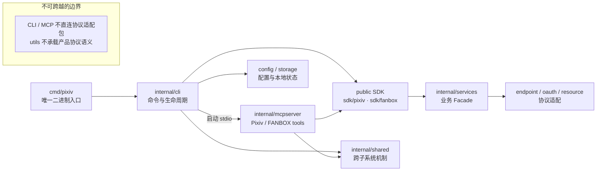

# 架构说明

[English](../../en/maintainers/architecture.md) | 简体中文 | [文档索引](../../index-zh-CN.md)

> [!IMPORTANT]
> CLI 与 MCP 只经 public SDK 和 owner-local 窄端口进入业务能力。生产组装可以依赖具体实现，但不能把 locator、runtime graph 或协议 adapter 暴露给命令层。

## 按读者查节

| 读者 / 关注点 | 去哪节 |
| --- | --- |
| 从入口到 SDK 的调用链 | [总体流程](#总体流程) |
| 某个包能做什么、不能做什么 | [包职责](#包职责) |
| 发布信任根与签名 | [Release assets 与信任边界](#release-assets-与信任边界) |
| 本地状态、配置、路径权限 | [internal/config/paths](#internalconfigpaths)、[internal/storage/file](#internalstoragefileatomiclockreplacesecret) |
| 硬约束清单 | [已知约束](#已知约束) |

## 总体流程

`cmd/pixiv/main.go` 是唯一官方二进制入口，它只负责调用 `internal/cli`：

1. `pixiv` 无参数显示 CLI 帮助。
2. `pixiv auth/config/update/search/timeline/detail/ranking/recommended/user/bookmark/follow/download` 进入 CLI 模式；root `--version` 是独立的只读 flag；`pixiv fanbox` 进入 FANBOX 模式；`auth import` 负责 direct token import 或 bundle restore，`auth export` 负责本地 secret snapshot。
3. `pixiv mcp` 与 `pixiv fanbox mcp` 由 CLI MCP 命令组装并运行独立的 MCP stdio server。
4. CLI 与 MCP 按命令 owner 显式构造生产资源：
   - 账号凭据来自 `~/.pixiv-cli/pixiv-cli.db`（SQLite，`internal/storage/database`；Windows：`%USERPROFILE%\.pixiv-cli\pixiv-cli.db`）；旧 `auth.json` 不自动读取，用户须显式导出/导入 bundle
   - 全局配置来自 `~/.pixiv-cli/config.toml`（Windows：`%USERPROFILE%\.pixiv-cli\config.toml`）
   - 公开环境变量作为覆盖层参与合并
5. 没有匿名 Web fallback：所有内容命令都要求认证态本地账号或显式凭据；已删除的 `web_fallback_enabled` 若仍显式存在则返回 `removed_setting`。

## 包职责

### `cmd/pixiv`

负责生成 `pixiv` binary 的 `main` package。它不承载业务逻辑，只委托 `internal/cli.Run` 并返回进程退出码。

### `internal/cli`

负责 CLI 用户态的命令分发与输出：

- Cobra 命令树、help 和 flag 解析。
- 文本/JSON 输出。
- `auth import [REFRESH_TOKEN]` 的输入 adapter：位置参数直接作为 opaque token；无参 TTY 隐藏输入，非 TTY 按首个非空白字节区分 opaque token 与严格 bundle；bundle 通过 stdin 管道或重定向离线恢复，不再有 `--file`。
- `auth export` 的 secret-output adapter：不带 `--output` 时，默认/UID 选择只输出 raw token 与换行，`--all` 只输出 versioned bundle；`--output` 改为私有文件并只输出无 secret 摘要。
- CLI 协议的 `--page`/`--limit` 解析与错误文案；解析后的逻辑分页计划交给 `internal/shared/pagination` 共享遍历算法。
- `auth login` 的 loopback OAuth、浏览器打开和 TTY 交互。
- `pixiv mcp` 分发。
- root `--version` 与 `pixiv update` 的输入/输出适配；已删除的 `version` 子命令在 Cobra 解析阶段返回 unknown-command。
- 普通 CLI 成功命令后的只读自动更新提示；提示和失败 warning 仅写 stderr。

当前 `internal/cli/root.go` 负责命令树、全局 flag、退出码与生产组装；一次执行的 close resource list 由其中的私有 `closeState` 持有。
`internal/cli/invocation` 只负责 `Streams`。命令 owner 通过显式 factory 与窄端口构造
config snapshot、DB、业务 Facade、lifecycle、media/download 与 update 依赖，并按逆序关闭资源。
CLI 不导出跨命令 locator，也没有独立 bootstrap constructor 或 `internal/cli/runtime`。

命令树由 `root.go` 统一处理全局 flag、需求驱动的启动生命周期与退出码，再交给 owner 命令包注册各领域命令：
根级 `internal/cli/commands/{config,mcp,update}`，Pixiv `internal/cli/commands/pixiv/{auth,bookmark,comment,detail,download,follow,mypixiv,ranking,recommended,search,series,timeline,user}`，
FANBOX `internal/cli/commands/fanbox/{auth,download,mcp,post}`。数据命令经 owner-local 窄
`Data` 端口（`Open`/`Pooled`/`JSONOut` 等）使用 public SDK `*pixiv.Client`/`*fanbox.Client`，不直连内部协议适配包；
共享 stdin codec 位于 `internal/cli/pipeline`，CLI/MCP 共用的稳定 Pixiv record 投影位于 `internal/shared/record`；该包只承接记录协议、JSON 归一化与 public SDK DTO 映射，不能依赖 CLI、MCP 或内部协议适配包，也不能扩展为通用杂物包。这些子包不反向导入 `internal/cli` 根包。

root `--version` stdout 精确为一行 `pixiv <version>`，stderr 为空且不运行 startup update check。已删除的
`version` 子命令在解析阶段返回 unknown-command、stdout 为空。自动更新只在普通业务命令成功后运行，跳过 MCP、help、root
`--version`、`update`、全部 `auth export`、bundle-form `auth import` 和开发构建；它选择 stable Release、使用用户
cache 的 24 小时节流，并最多等待 3 秒。配置、网络、来源识别失败只作为 stderr warning，不能
改变已成功业务命令的退出码，也不能混入 JSON stdout 或 MCP JSON-RPC。
进程启动时的 Windows pending-update cleanup 也属于潜在 mutation；全部 `auth export` invocation 在 Cobra
解析前即识别并跳过该 cleanup，其他命令仍沿用正常 startup cleanup。root bool flag 的重复覆盖语义由
聚焦测试保护，不能让 `--help=false` 等写法误绕开 secret export 边界。

### `internal/cli/commands/pixiv/auth/loginhelper`

负责 `auth login` 的系统 URL scheme helper、持久 handler manifest、一次性 remote handoff 私有状态与 remote callback client。
`internal/cli` 只经该包安装按需 handler，保留 OAuth、loopback HTTP、系统浏览器、TTY 和 relay server 编排。handler
只允许精确的 `pixiv://account/login` 与 `pixiv://account/remote-login` 进入本轮操作；活跃 loopback 优先，远程 callback
只投递给活跃的一次性 handoff，其他 `pixiv://` URL 定向给 manifest 保存的旧 handler。desktop private state 只保存当前
handoff 的 relay origin、会话 ID 与 capability；server 不保存 desktop 设备记录，public SDK 不暴露这些状态。remote callback
只接受同一 relay base 的一次性 result URL，`internal/cli` 打开无敏感的最终页后等待 OAuth exchange。
Darwin 独立持有嵌入 Swift、`Info.plist`、LaunchServices；Windows 使用当前用户 registry/class 启动；desktop Linux 使用
XDG desktop entry 与 `gio`。headless Linux 不注册 handler，但可运行 relay server。

### `internal/shared/buildinfo`

保存由 Go linker 注入的 `Version`。本地默认是 `dev`；
只有 version 为 `dev` 的构建被视为开发构建，并必须拒绝自更新。

### `internal/shared/record`

负责 CLI/MCP 共用的稳定 Pixiv record 投影：保留 public `sdk/pixiv` DTO 的未知字段，
固定 `id`、`type`、`url`，提供 JSON 归一化、版本元数据清理和基于记录字段的本地筛选。
该包不依赖 CLI、MCP 或 `internal/services` 协议适配包；MCP 自身的输出 schema 与 DTO 包装仍由
`internal/mcpserver/pixiv/internal/records` 负责。

### 业务 Facade、账号与通用遍历

- `internal/services/pixiv` 是 Pixiv 业务 Facade，聚合 `account` 与 `pool` 等业务叶 Module。`account` 负责本地账号、登录完成、默认账号、凭据 identity/rotation 与账号管理；`pool` 负责选择、冻结、Gate、safe replay 与相关错误语义。
- `internal/services/fanbox` 是 FANBOX 业务 Facade，聚合 FANBOX `account` 叶 Module 与 client lifecycle；FANBOX session 不与 Pixiv refresh token 共享类型或生命周期。
- `internal/shared/lifecycle` 只承载协议无关的生命周期、Lease 与 Attempt；它不拥有 Pixiv/FANBOX 账号选择、凭据或重放策略。
- `internal/shared/traversal` 只承载泛型可重入分页遍历（opaque cursor、逻辑 skip/limit、单批兼容语义与重复 cursor 止环）；bookmark 等产品筛选策略仍留在各 CLI/MCP search adapter。

配置 schema、`config.toml` path/get/set/unset、自动生成的默认文件与一次执行所需的 immutable `Snapshot` 位于 `internal/config/settings`；协议无关的日期按月截断纯函数位于 `internal/utils/date`。CLI/MCP 经 owner-local 窄 Seam 与 MCP runtime `SDKPorts` 使用业务 Facade，不直接依赖上游 Adapter。`internal/account` 与 `internal/session` 已删除，不保留兼容 alias。

### `internal/shared/diagnostics`

提供显式、内存内的 typed diagnostics scope。Pixiv MCP、FANBOX MCP、Pixiv/FANBOX
network transport、账号池、下载与 FlareSolverr 只通过 scope 发出允许的模块、operation、route、status、
proxy、UA、request ID、reason 和计数等字段；默认使用 Nop sink。MCP request scope 只影响诊断，不改变
JSON-RPC stdout。该包不创建日志文件、不保存 response body、
Cookie、token、signed query 或 arbitrary error dump；公共 SDK 在没有显式 scope 时保持静默。

### Release trust root（`internal/update/installer`）

`internal/bootstrap` 已随 v1 迁移删除，不再是 CLI/MCP composition root。production Ed25519 public trust root 的
key ID 与 public key 常量位于 `internal/update/installer/release_installer.go`；`internal/cli/commands/update/production.go`
组装 key ID→public key map 并交给 Release installer，避免调用方污染 trust root。`internal/cli/root.go` 只委托 update command，
不构造 trust root。公开 key 的 fingerprint 与已知签名 fixture 由 installer 同包测试验证；私钥不在源码或运行时配置中。
只读更新检查不需要该 key；该 wiring 本身也不能代替每个版本独立的发布验收。

### `internal/storage/database`

负责本地账号状态的 SQLite authority：

- `pixiv-cli.db` 的 schema、migration ledger 与 repository；账号 identity/credential 以 `user_id`
  为 key，Pixiv rotation 与 FANBOX session replacement 使用 `credential_revision` compare-and-swap。
- SQLite 使用截至 schema v3 的向前迁移：会把旧 v1 数据库推进到 v2/v3；对于本树初始 schema 已经包含的最终字段，会记录兼容迁移而不重复执行冲突 DDL。旧 `auth.json` 与旧 `account_pool.accounts` 都不属于启动迁移路径。
- 平台对应的私有 DB/journal 文件权限（Unix-like `0700`/`0600`）。
- auth export 只读取默认、精确 UID 或全部本地账号；不读取环境 token、不刷新、不联网、不修改状态。

旧 `auth.json` 不再作为 store 或 fixture API。用户须在旧版本显式执行
`pixiv auth export --all --output <private bundle>`，再在新版本执行
`pixiv auth import < bundle.json`；失败原因直接返回，不自动删除旧文件。

### `internal/config/settings`

负责 `config.toml` 及运行时配置：

- `config.toml` schema、默认值和配置键定义。
- 运行时配置合并：`config.toml` 与公开环境变量。
- `pixiv config path/get/set/unset` 需要的强类型解析与稀疏写回。

配置拆分如下：

- `pixiv-cli.db`：保存账号 identity 与 credential（`pixiv_account`/`fanbox_account`），DB 文件权限为 `0600`；旧 `auth.json` 不自动读取。
- `config.toml`：保存全局配置键，包括 `[pixiv.auth].default_user_id` 与 `[fanbox.auth].default_user_id`；Unix-like 文件权限为 `0600`。首次生成的精简基线由 `SettingSpec` 元数据生成，只包含标记为 `DefaultInFile` 的项；高级配置在显式写入前继续省略。未设置默认账号时按 `sort_order` 选首个账号。

运行时设置使用 `koanf` 合并 `config.toml` 与公开环境变量；`config set/unset` 使用 `tomledit` 写回，尽量保留注释、顺序和布局。

`internal/config/settings` 定义 `FileStore` port，由 CLI private composition graph 注入 `internal/storage/file/{atomic,lock,replace,secret}` 的协议无关文件机制：于目标同目录使用不含
凭据内容的随机文件名创建临时文件，完成全部写入并执行 file `Sync`，关闭文件后才替换目标。Unix-like 平台
主动把父目录与文件分别收紧为 `0700`、`0600`，原子替换后继续同步目标目录；
若本次调用新建了一层或多层目录，则在替换提交后按 leaf→root 顺序同步目标目录及每个新目录
的外层 parent，使文件 entry 与新目录 entry 均进入 durability 边界；既有目录仍只同步目标目录。
任一目录同步失败时仍会尝试其余目录并合并错误，替换已经提交，调用方不能假定旧文件仍在。替换前的写入、file `Sync` 或关闭
失败会保持旧目标；普通替换失败以及可恢复的部分完成失败也会保持或恢复旧目标，并清理临时
文件。若部分完成后的恢复本身失败，调用方会收到组合错误，目标路径可能暂时缺失，但旧内容的
同目录 recovery backup 与新内容的 source temp 都会保留供人工恢复；此时“No temp residual”不适用。
其他临时文件清理失败不会被吞掉，而会与主错误一并返回。

Windows 在替换前同样执行 file `Sync` 与关闭：目标存在时，使用带同目录唯一 recovery backup 的
`ReplaceFileW`；首次创建使用不覆盖目标的 `MoveFileEx`。`ERROR_UNABLE_TO_MOVE_REPLACEMENT`
保持 target/source 原名；`ERROR_UNABLE_TO_MOVE_REPLACEMENT_2` 会尝试把已移动到 backup 的旧目标
恢复，恢复失败则保留 backup/source。成功替换后的 backup 清理失败属于已提交错误，仍按已提交
路径处理。Windows 首次创建的文件继承父目录 ACL，替换既有目标时保留该目标 ACL；本协议不会
主动添加或放宽 ACL，但也不声称 `Mkdir`/`Chmod` 会收紧 DACL，亦不提供 POSIX mode 或 directory
fsync 的等价保证。

`update_check_enabled` 对应 `[update] check_enabled`，默认 `true`；它只控制普通 CLI 成功后的
自动检查，不禁用用户显式执行的 `pixiv update`。

### `internal/browsercookies`

负责只读的浏览器 cookie provider，不属于公开 SDK，也不依赖 FANBOX、Pixiv、CLI、MCP 或账号 store。
根包（core）是 protocol-neutral：只接受固定的 `CookieQuery`，按安全 profile identifier 发现浏览器目录，
并以脱敏 `Secret` 返回目标值；`chromium` 支持显式的 Chrome/Edge provider，`firefox` 解析 `profiles.ini`，
`safari` 只在 macOS 解析 `Cookies.binarycookies`。未知的 Chromium derivative 不做模糊识别，多个 profile
未指定时明确失败。系统/browser integration 位于 `internal/browsercookies/system`：它 import 并注册全部
provider 子包，使根包 `New` 可分发所有浏览器；根包不导入任何 provider 子包，单独导入根包不会注册浏览器。

平台秘密边界保持在 `secret` 子包：macOS 走 Keychain，Windows 走当前用户 DPAPI，Linux 通过固定属性的
Secret Service `secret-tool` 查询。Chromium provider 按平台 profile 根目录读取 Local State/Cookies，
支持 v10/v11 GCM 与 legacy CBC；系统工具缺失、权限、锁、schema drift 和解密格式错误都映射为稳定错误，
不把 cookie、密钥、绝对路径或命令输出写入日志、错误、JSON 或 MCP。跨平台 native provider evidence
仍须按 v1.0.0 release-prep runbook 在对应 host 执行，离线 fixture 和交叉编译只证明代码/格式契约。

### `internal/update`

根包只保留 coordinator 与 automatic-check API（thin root）；安装来源识别、GitHub Releases 查询、SemVer 选择、
cache、显式更新策略与 Release binary 安装协议分别由 `internal/update/{source,release,installer,process}` 实现，
并由根包 re-export 给 CLI composition root：

- Homebrew 通过 executable symlink 与 keg `INSTALL_RECEIPT.json` 区分 stable/beta；两个
  formula 的转换会先卸载冲突 formula，失败时显式尝试恢复原 formula。
- `go install` 需同时匹配 Go build info 与实际 `GOBIN`/`GOPATH/bin` executable；更新总是使用
  选中 Release 的精确 tag。
- 其他正式二进制视为 Release 安装。安装前需选中本平台 archive、验证 Ed25519 签名的
  `checksums.json`、验证 archive SHA-256、解包后运行 `pixiv --version` 精确预检，再以同目录
  原子替换。
- GitHub Releases API 是唯一查询后端；draft 被排除，stable 检查不纳入 prerelease。ETag/cache
  用于节流与原子保存。
- 更新选择器对当前检查通道的 published Release 强制 canonical SemVer；任一 tag 不合法时
  fail-closed 并报告该 tag，不会跳过它而选择较旧版本。stable 选择会在校验前先排除
  GitHub 已标记的 prerelease。签名、checksum、不可变 tag 和安装前预检共同构成 Release 信任边界。

该包不得把签名、checksum、HTTP、archive、替换或权限错误伪装成“无更新”。production trusted key、
签名私钥与 Keychain 恢复副本、受保护 `release` Environment 和公开 remote 已按 Task 20 配置；完整六目标
native evidence 与 staticlib manifest 已回填。v0.3.0 已完成正式 tag、受签名 Release 与 stable tap formula；
Release 安装的失败语义仍是保护边界，而不是临时降级。

### `scripts/cmd`、`scripts/tests` 与 `scripts/internal`

每个仍在使用的脚本入口位于 `scripts/cmd/<name>/main.go`，只负责参数解析和调用对应的 owner
package。纯测试载体位于 `scripts/tests/`：它们只验证 workflow、文档或 installer 行为，不承载生产实现。
实现逻辑与同包测试位于 `scripts/internal/<name>`。共享 verifier/发布契约位于
`scripts/internal/workflow/yaml`（release 与 native evidence verifier 共用的 YAML AST 安全操作）、
`scripts/internal/releasecontract`（Release/native-evidence 契约与 per-target Rust toolchain 映射）与
`scripts/internal/releasenotesrender`（GitHub Release 正文渲染，被 `releaseassets` 与历史同步共用）。

### `sdk`、`sdk/pixiv`、`sdk/fanbox`

公开 SDK 是唯一对外契约面，只从这三个 package 导出：

- `sdk`：共享的 `Page[T]`、`Cursor`（Text/JSON codec）、`Error`（sentinel、context chain、脱敏）、`ResourceRef`/`Resource` 与资源 request/response/save 类型。
- `sdk/pixiv`：Pixiv App-only SDK。`Open/OpenWith/New/NewWith` 构造器、OAuth `LoginSession`、credentials rotation、规范化模型、opaque cursor、`ParseURL` 与资源读取。没有匿名 Web 路径。
- `sdk/fanbox`：FANBOX SDK。`Client.ValidateSession`、creator/tag/post/home/supporting、两类 pagination 与资源读取；不读取浏览器、DB 或 Pixiv credentials，也不 import `sdk/pixiv`。

FANBOX native transport 使用 Chrome 146 TLS profile 与内置 Firefox 148 HTTP User-Agent baseline，并只在构造时接收显式的 HTTP client、proxy、UA 与可选
FlareSolverr options。`FANBOXSESSID` 只允许在 `api.fanbox.cc` 与 `downloads.fanbox.cc` 的受校验请求中
传播；第三方 CDN、Pixiv host 与 solver control request 均不携带该 Cookie。solver control transport
直连 FlareSolverr，solver upstream proxy 只作为 solver 配置传入，不继承 native 或宿主环境 proxy；
challenge 之外的 API/资源错误不自动进入 solver。

旧顶层 `pixiv/` facade 已在 v1 删除；`pixiv` 作为 import alias 保留给 `sdk/pixiv`。认证备份（`AuthExportSelection`/bundle codec）仍经 `sdk/pixiv` 的同一 local snapshot 边界。bundle 含 opaque refresh-token secret，是未加密的 point-in-time backup，不是 live sync；token rotation 后旧 bundle 或其他机器上的副本可能 stale。

调用方在自身 adapter 中定义 source mode、budget、filter、cursor 持久化和 HTTP presentation。本仓库不提供 HTTP Provider、Discover、Probe、Capabilities、RSS 或 crawler。

### `internal/services/pixiv/protocol`、`appapi`、`oauth`、`resource`

这些现有路径在迁移后仍保留为上游 Adapter，只由公开 SDK 组合；它们不承载账号/会话业务 Facade：

- `protocol`：上游 base、profile header、endpoint catalog 与脱敏 adapter failure 的唯一来源；不读配置、不发请求，也不保存响应 body、URL、header 或凭据。
- `appapi`：有凭据的 App API transport/auth/retry adapter。它只向 endpoint family 暴露窄的 `GetJSON`/`GetRaw`/`PostForm` 能力；幂等 JSON/原始响应读取只会在首次 429 的有效 `Retry-After` 后按 context 重试一次，不再承载 novel/user/artwork business method、route facade 或 raw DTO/mapper。
- `oauth`：PKCE、code exchange、refresh 与 token state。
- `resource`：受 policy 约束的 resource transport、redirect/header/body 边界。

v1 已删除 `internal/services/pixiv/webapi` 与匿名 Web/AJAX 路径：App API 出错直接返回规范化错误，不自动切换协议。Pixiv endpoint family 位于 `internal/services/pixiv/endpoint/{artwork,novel,user}/<leaf>`，各 family 自有 route、request、raw DTO、mapper 与 continuation/error 校验，父包只拥有 normalized entity/value。FANBOX 的 `internal/services/fanbox/protocol` 只拥有产品专属 session、cookie、challenge、URL policy 与窄 transport；`internal/services/fanbox/endpoint/{creator,post}/<leaf>` 与 `resource` 各自拥有 endpoint route/fixture/转换。`sdk/fanbox` 直接组合这些 Adapter capability，不依赖业务 Facade。

### `internal/services/pixiv`、`internal/services/fanbox`（业务 Facade）

迁移后，两个产品根包分别聚合账号与会话业务，不把 CLI/MCP DTO、filter、record、schema 或输出适配带入 services。Facade 只依赖业务叶 Module 的 Port、配置快照、协议无关的共享 Module 与 public SDK；不得依赖 `internal/storage/database` 的具体实现，也不得由 public SDK 反向 import。

`internal/services/pixiv` 的业务 Facade 统一账号打开、登录完成、凭据 rotation、账号池选择/冻结/safe replay 与 Lease 生命周期；`internal/services/fanbox` 统一账号选择、session 校验与独立 client 生命周期，但不引入 Pixiv 账号池策略。

### reverse-search Facade 例外

反向搜图是唯一跨越常规 public SDK 边界的产品能力。顶层契约与 Facade 位于 `internal/services/reversesearch`，provider 协议适配只位于 `internal/services/reversesearch/saucenao` 与 `internal/services/reversesearch/ascii2d`。生产组装 `internal/cli/root.go` 可以依赖 `internal/services/reversesearch/assembly`，在每个命令/session 启动时绑定 HTTP client、代理和 SauceNAO key；`internal/cli/commands` 下的 CLI owner 与全部 `internal/mcpserver` 只能 import 顶层 `internal/services/reversesearch` 契约，不得 import provider 子包或 assembly。Facade 返回领域结果，CLI/MCP 只在输出边界投影 canonical Record。

Facade 会把常规文件或 HTTP(S) source 载入一个私有快照、计算 hash，并在 provider 工作结束后清理。已确认的 source policy 有意允许任意可读常规文件以及私网、loopback、link-local URL；因此 MCP 必须处在可信本机 client 边界之后。source 与 provider transport 都不能跨过输出边界；可发布的只有 source kind/hash、安全的 provider 摘要/错误、领域 evidence 和 canonical `artwork`/`user` Record。

### `internal/services/pixiv/endpoint/{artwork,novel,user}`

三个 parent 包只拥有各自 endpoint family 共享的 normalized entity/value；route、wire DTO、响应校验、分页与 mutation form 留在对应的子 family。novel 与 user 不再通过共享 model 包传递，避免 appapi 或跨域 mapper 重新成为业务 owner。MCP delivery 等传输层常量仍留在 `internal/mcpserver`。

### `internal/mcpserver`

负责将 Pixiv 与下载能力注册为 MCP tools。所有 Pixiv 内容、认证、资源和写操作都通过 public SDK 使用；下载由 client execution snapshot 对应的 `DownloadManager` 执行。MCP 的 nullable `page`/`limit` 只在本 adapter 解析；逻辑分页遍历由 `internal/shared/traversal` 共享引擎执行，旧 offset wire 字段已移除。stdio transport 与 runtime lifecycle 留在各产品 internal runtime，由 CLI command 组装和启动。

包内按产品拆为 `internal/mcpserver/pixiv` 与 `internal/mcpserver/fanbox`，各自只保留构造与注册聚合；共享运行时（App、SDK ports、paged read/write、record filter）位于 `internal/mcpserver/{pixiv,fanbox}/internal/{runtime,records,filters,outputs}`。每个 tool 一个 package（例如 `internal/mcpserver/pixiv/tools/search_illust`），拥有自己的 input/output 类型、schema 与 handler adapter，只依赖共享窄端口。MCP 不自行实现表达式、重试、归档或文件模板：它在打开 SDK operation 前编译输入，再把下载适配交给 `internal/media/downloader`；公开 SDK 不承担批量下载语义。运行期 handler 的失败结果保留其 structured output 并使用 `isError=true`；正常空结果不会伪装成失败。完整 wire 语义见 [MCP 工具](../mcp-tools.md#错误分页与输出)。

### `internal/media/downloader`

负责下载和本地文件落盘：

`internal/media/downloader` 是 CLI/MCP 的下载 owner。它以 `DownloadTargetClient`/`DownloadClient` 接收 public SDK client execution snapshot，统一负责来源展开、ID 去重、页码和质量校验、文件获取与 publication、进度事件和 ugoira 格式选择；这些语义不能在 adapter 中复制。`ResourceRef` 仅由产品 Client 解析，下载器只消费已验证的 opaque ref。公开 SDK 只保留原子资源解析/保存能力，不暴露批量下载工作流。

- `Download` 会同步下载 ID 列表，并返回每个作品的实际产物路径。
- 单页作品保存到下载目录。
- 多页作品和 ugoira 会建立作品子目录。
- 单页与多页作品从上游 URL path 推导扩展名，并与模板生成的文件名一样规范化跨平台非法字符；Pixiv 缩略图会在资源响应提供明确 Content-Type 时按实际图片格式修正 URL 后缀，未知媒体类型保留 URL 扩展名。
- ugoira 先下载 SDK 验证的 `download_url` zip，再由 Rust FFI encoder 合成为 GIF/APNG，或由 public SDK 原样发布 ZIP/提取 frames；认证态可合法选择 App medium，绝不把它标记成 original。

Rust crate 以 target 专用 staticlib 接入 cgo：darwin/linux/windows 各有 amd64/arm64 selector；Linux
selector 还显式链接系统 `libm`，承接 Rust/image staticlib 的 `sinf`/`expf` 符号；Windows selector 以
`-L${SRCDIR}/… -lugoira_rs` 与 Rust std 的 Windows import libraries 传递 `*-pc-windows-msvc` library，
避免 cgo 拒绝带驱动器号的裸 `.lib` 路径；native-evidence 在 Windows 的链接步骤明确使用 runner 提供的
`clang -fuse-ld=lld`，避免 Go 的 GCC-only debug linker script 交给 MSVC linker。受支持
的 release/source build 必须从同一 Rust source digest 的六目标 `manifest.json` 选择并链接真实库；
无 cgo、无 target library 或无 C linker 时应在编译/构建期明确失败，不能回退到 `ffmpeg` 或 runtime
stub。Source identity 纳入 first-party crate 的 Cargo/build/source 输入、vendor 闭包与本地
`quantette`；这些路径在 `.gitattributes` 中禁用 Git 文本转换，使 Windows 与 Unix checkout 保持同一
Git blob bytes，而不是在摘要算法中掩盖差异。摘要算法先把 `filepath.Rel` 的 Windows 反斜杠转换为
logical slash path，再筛选 `src/`、`.cargo/` 与 `vendor/`；run `29189725013` 证明若顺序相反，即使
六个 runner job 均 success，也会产生 Unix/Windows digest split 并被 consolidation fail-closed。
该 run 不可回填或与后续 run 拼接。Rust `target/` 是机器产物，staticlib/manifest 是经过 native
验证后才可提交的发布输入。
release archive 的 `LICENSE` 与生成的许可证 bundle 同样固定 LF checkout；run `29191200569` 的六份
source digest 已一致，但 Windows archive 的 `LICENSE` bytes 仍与 Unix/Git blob 分裂，因此
consolidation 再次 fail-closed。该 run 也不可回填或跨 run 拼接，必须从修复后的新 SHA 完整重跑。
`internal/media/ugoira/staticlib` 只承载 source digest 与 manifest 的完整性契约，不导入 cgo encoder；
因此 native-evidence 的 **policy** gate 可以在目标库生成前执行。`record` 与 `consolidate` 同样不
触发 cgo 链接，但分别仍需要已生成的 staticlib/binary/archive 与完整六份 evidence 输入；下载运行时
仍只由 `internal/media/ugoira` 通过唯一 FFI 入口链接 `internal/media/ugoira/rust`。

run `29192425899` 已在六个平台完成 native build、真实 cgo GIF/APNG smoke、binary/archive record，
并经本地 fail-closed consolidation 回填六个 target library 与统一 manifest（该 run 是首次 evidence
收集，职责已被后续 run `29567721284` 的 pinned-toolchain 重建取代为当前 committed 六库的唯一来源，
见 `development.md` 的 provenance 说明）；source build 会在链接前
校验该 manifest 和库哈希。`ffmpeg` 仅保留给显式启用的开发质量对照，不在生产下载路径中。

### `internal/media/ugoira`

拥有 ugoira 的 `Format`、帧输入、`Encoder`、唯一 cgo FFI 入口、Rust crate 和 staticlib/source-digest 完整性契约。下载器只依赖该包的 `Encoder` 接口并构造 Rust encoder，不得复制 FFI adapter 或 publication 行为。`internal/media/ugoira/staticlib` 只验证 manifest、source digest 与提交的目标库文件，不反向导入 cgo encoder。

## Release assets 与信任边界

`scripts/cmd/releaseassets` 以固定六目标封装 archive：darwin/linux 为 `.tar.gz`，Windows 为 `.zip`；
每个 archive 包含一个 `pixiv`/`pixiv.exe`、`LICENSE`、`THIRD_PARTY_LICENSES.md` 与完整
`third_party/licenses`；它们在 Git 中固定 LF，以便 licensebundle 在 Windows 也可按字节校验。
Windows Git Bash 缺少 `zip` 时，打包脚本明确使用 runner 预装的 `7z`；其他平台使用 `zip`。两条分支
生成相同的 member 集合，缺少对应归档器会直接失败而不会产出不完整 asset。
finalize 阶段收集这六个 archive 的 SHA-256 到 `checksums.txt`，并为原始
checksum bytes 生成带 key ID 的 Ed25519 `checksums.json`。

`.github/workflows/release.yml` 将签名/发布放在受保护的 `release` Environment 中；它使用最小权限和
full-SHA Actions，并在草稿 Release 上传后核对 asset 集合才发布。发布 job 将同一份已验证
`release/checksums.txt` 交给下游 renderer；stable/prerelease 分别生成唯一的 `pixiv-cli`/
`pixiv-cli-beta` formula。四个原生 macOS/Linux runner 将该 formula 安放在各自隔离的 local staging
 tap 后，以 tap-qualified formula name 真实安装并核对 `pixiv --version`；此路径不使用或写入
公开 tap，Homebrew 6 所需的 trust 仅精确写入 runner 本地 staging tap 的临时 trust store。最终受保护
job 才能读取独立 tap deploy key 并只 push 对应 formula。
v0.3.0 的正式 tag 已走完此发布路径并推送 stable formula；后续 tag 仍必须独立满足同一安装 gate。完整
六目标 native 成功证据已回填 staticlib/manifest。production signing 私钥、Environment 与公开 remote
已按 Task 20 配置，受支持 binary 的公开 trust root 已在 `internal/update/installer/release_installer.go` 配置。Rust crates.io 依赖已由
crate 内 source replacement 固定到完整 vendor 闭包，并以空 Cargo cache 离线 metadata/build/test 与六
target 许可证检查验证。

Homebrew formula 模板由已验证的六目标 `checksums.txt` 生成，仅使用 macOS/Linux asset；stable
`pixiv-cli` 与 beta `pixiv-cli-beta` 相互冲突且同装 `pixiv`。tap credential 与发布 key 是不同的
信任域：tap 私钥只允许进入最终受保护 deploy job 的最后 push step，不能代替 Release Ed25519 trust
root。公开 tap 的 stable formula 已对应 v0.3.0；beta formula 仍只由 pre-release 通道写入。由于 draft
Release 的匿名 URL 不可安装，Release 会先公开再执行四架构 gate；失败会保留已公开 Release 供处置，
但不会写对应 formula。

当前 Release archive 不计划包含 Apple notarization 或 Windows Authenticode。用户收到 Gatekeeper 或
SmartScreen 提示时，必须回到已验证的项目 GitHub Release、checksum 和签名记录，不能把系统提示视为
可由 CLI 静默绕过的错误。

### `internal/config/paths`

不保留通用 constants 包。`config/paths` 唯一拥有 app-managed 路径、`AppDataDirName` 与
Unix-like 私有目录/文件权限常量；它不读取业务配置，也不实现文件写入。Pixiv 协议值、MCP delivery
值与 config key/default 仍留在所属领域包。`internal/shared/diagnostics` 拥有 typed、协议无关的事件契约，
`internal/cli/diagnostics` 拥有由 `[logging]` 控制的 text/JSON stderr presenter；这不是持久 operation 日志，
也不是历史通用 `slog` 链路。MCP stdout 仍保留给 JSON-RPC，错误继续经 CLI、MCP 或 public SDK 的既有接口传递。

### `internal/storage/file/{atomic,lock,replace,secret}`

四个 leaf package 分别拥有原子写入、文件锁、替换/recovery 与私密文件 writer；它们只依赖
`config/paths` 的路径/权限约定，不拥有配置 schema、账号状态或 Pixiv 协议语义。

### `internal/utils`

只保留无协议语义的纯 helper：`parse` 负责正整数解析，`text` 负责字符串默认值，`uri`
负责 URL path 提取与 file URI 生成，`date` 负责按月移动并在目标月份按月末截断。

文件名清理、模板展开归 `internal/media/downloader/filename`，ID 去重与媒体 MIME 类型归 `internal/media/downloader`；
refresh-token 校验归 `internal/services/pixiv/oauth`；路径/权限归
`internal/config/paths`，原子写入、锁、替换和 secret export writer 归
`internal/storage/file/{atomic,lock,replace,secret}`。这样 `internal/utils` 不再承担具体设施或产品领域职责。

## 已知约束

> [!WARNING]
> 以下约束是不可违反的硬边界。任何新增 timeout、截断、条数限制、重试上限、静默 fallback 或隐藏降级都必须有证据、注释、测试或文档说明，否则视为违规。

- `appapi`、`oauth` 与 resource transport 使用 caller/SDK 注入的 HTTP client；默认 client 专用于当前 SDK client、无整请求固定 timeout，取消与 deadline 由 context 传播。显式 client 保持调用方策略。
- `pixiv mcp` 与 `pixiv fanbox mcp` 是两个独立 MCP stdio server 的显式启动方式；直接执行 `pixiv` 不会启动 MCP。
- 不新增持久账号 import/export MCP tool；既有 session-scoped MCP 认证 tool 与 wire contract 不变。
- 账号 credential 保存在 SQLite `pixiv-cli.db`（BLOB，非加密）；Unix-like DB/journal 文件权限为 `0600`。获得当前用户文件访问权的攻击者仍能读取 credential，自动 backup 被禁止。
- `config.toml` 采用稀疏写入，不会把默认值整份落盘。
- `download_random_from_recommendation` 的 `count` 缺省为 5，显式值须为 1..20，超范围会返回参数错误而非静默钳制。20 限制的是请求作品数：一次请求可触发多个作品下载，每个作品又可展开为多页/多文件，全部产物元数据会进入同一 structured response；该边界避免无界放大下载工作与 JSON-RPC 输出，不截断单个作品的文件。推荐列表不足请求数时下载实际可用数量。
- `download` 只返回本地路径、`file://` URI、`mime_type`、页号与大小；不内嵌 ImageContent 或 base64 缩略图。
